# 小白也能看懂的Github上传项目 / 贡献教程（适合设计同学、非专业同学...）

> 本教程采用Windows系统做演示

## 前言：为什么要写这个教程？

你是否有过这样的困惑：

> 「我做了一个很棒的项目，想要分享到GitHub上的开源项目中，但是完全不知道从何下手...😢」

作为一个小白，我第一次接触GitHub时也是一头雾水。当我被要求把自己制作的《赛博哪吒：天机觉醒》AI视频教程上传到GitHub开源项目（[Design with AI](https://github.com/datawhalechina/design-with-ai/)）中参与共建时，我完全不知道该怎么操作（救...）


*Design with AI 开源项目*


但当我真正理解了GitHub的工作方式后，才发现其实很简单！所以我写下这篇教程，希望能帮助和我一样的设计专业同学或其他GitHub小白，轻松参与开源项目的共建。

**全教程均小白化，会以最通俗的话术来讲解，请放心食用！**

> 注：强烈建议小白使用Trae（免费）或Cursor（条件免费）来辅助自己上传项目，因为有个AI大师会一步步指导你怎么上传！

## 一、GitHub是什么？为什么要用它？

在开始操作前，我们先来理解一下GitHub到底是什么，以及为什么我们需要用它。

### 1. GitHub是什么？


*Github 官网*

想象一下，GitHub就像是一个**超级云盘+社交平台**的结合体：

- **超级云盘**：它可以存储各种项目的代码、文档、图片等文件
- **社交平台**：不同的人可以一起协作完成一个项目

### 2. 为什么要用GitHub？

1. **参与开源项目**：可以和全世界的人一起创造有价值的东西
2. **展示自己的作品**：就像是程序员和设计师的作品集
3. **版本控制**：可以记录每一次修改，随时可以回到之前的版本
4. **团队协作**：多人可以同时在不同地方修改同一个项目

## 二、GitHub的工作方式：总部-分部模式

理解GitHub最简单的方式，就是把它想象成一个「总部-分部」的工作模式：

### 1. 总部（原始仓库）

现在我们有一个大型开源项目（比如我们要参与的设计领域的 [Design with AI](https://github.com/datawhalechina/design-with-ai/)），它就像是一个公司的「总部」。总部保存着项目的主要内容，由项目的管理者/维护者（散步师傅）负责管理。

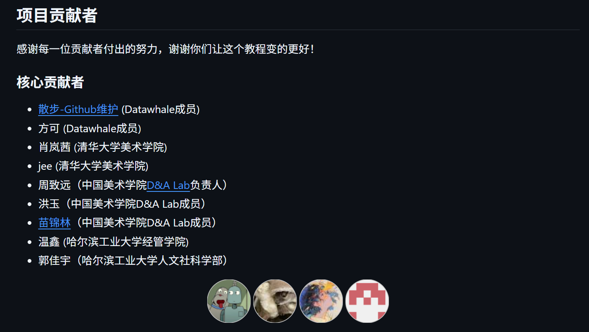
*项目贡献者*

### 2. 分部（你的Fork仓库，也就是副本）

当你想为这个项目做贡献时，你不能直接修改「总部」的内容。相反，你需要先创建一个属于自己的「分部」（副本，Fork），这个分部是总部的完整副本，**但完全归你所有。**

### 3. 工作流程

整个GitHub的工作流程可以简化为**三步**：

1. **Fork（复制）**：把「总部」的项目复制一份到你的账号下，创建「分部」
2. **修改**：在你的「分部」中进行修改、添加内容
3. **Pull Request（提交申请）**：完成修改后，向「总部」提交申请，请求合并你的修改

> 这就像是：
> - 你看到一本很棒的百科全书（总部）
> - 你复印了一份（Fork到你的账号）
> - 你在复印件上添加了新内容（在你的Fork中修改）
> - 你把新内容发给原作者，请求加入到原书中（Pull Request，PR）

理解了这个工作流程，GitHub就变得简单多了！

## 三、准备工作

在开始上传项目前，我们需要做一些准备工作：

### 1. 注册GitHub账号

如果你还没有GitHub账号，请先去 [GitHub官网](https://github.com/) 注册一个账号。

### 2. 安装必要的工具

#### 2.1 安装Git

Git是一个版本控制工具（是个很聪明的助手，可以帮我们记录项目的完整历史），我们需要它来管理我们的代码和文件。


*Git 下载页面*

1. 访问 [Git官网](https://git-scm.com/download/win) 下载安装包
2. 双击下载的安装包（例如：Git-2.x.x-64-bit.exe）
3. 一路点击"Next"使用默认设置即可
4. 安装完成后点击"Finish"

**验证Git安装：**

5. 按下 `Win + R`
6. 输入 `cmd` 或 `powershell`
7. 点击`确定`
8. 在打开的窗口中输入：
   ```
   git --version
   ```
9. 如果显示Git版本号，说明**安装成功**

**配置Git身份：**

在命令行中输入以下命令（**替换为你的信息**）：

```
git config --global user.name "你的GitHub用户名"
git config --global user.email "你的邮箱地址"
```

> 提示：GitHub用户名就是你页面右上角头像的那个名字，邮箱在 "头像→Settings→Emails" 可查看绑定的邮箱

#### 2.2 安装AI辅助工具（强烈推荐！！！一定要！好吧！）

强烈建议小白使用以下工具**之一**来辅助上传项目：

- **Trae**（免费）：AI辅助编程工具
- **或者 Cursor**（条件免费，自行查看学生优惠）：另一款AI编程助手

**这些工具有内置的AI助手，可以一步步指导你完成上传过程！**

用Trae来上传项目（直接在终端中控制，“终端”也就是命令行，用来发命令的！），有不懂的步骤右侧也可以直接向AI提问（Claude模型感觉在代码能力上比较强，所以推荐它）

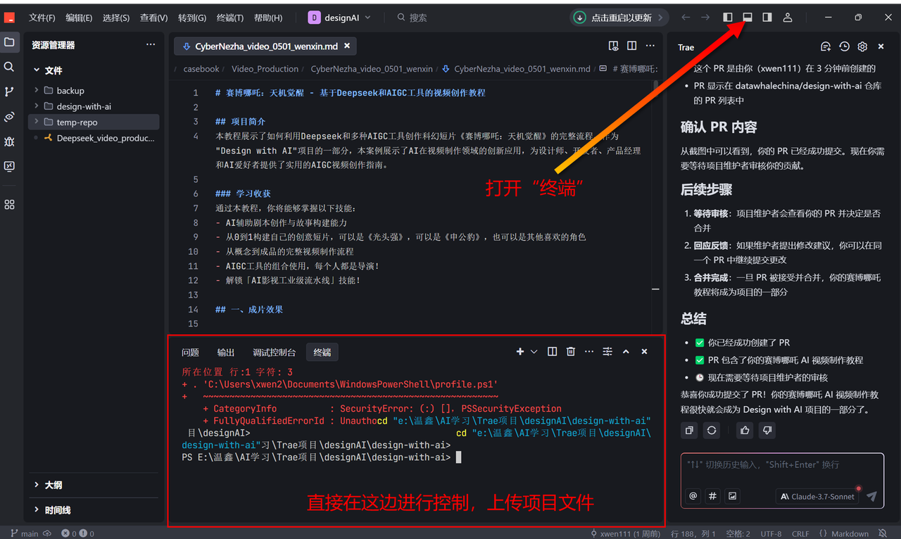
*Trae 中显示终端*

另外，推荐安装VSCode来编辑和预览Markdown文件，它可以让你看到渲染后的效果（就是上传到GitHub后的显示效果），Trae和Cursor也能预览Markdown文件的！（嫌麻烦的话，可不下载VScode，直接用Trae就可以，预览md文件方法一样）

点击`Show Source`按钮查看效果，进行编辑排版。

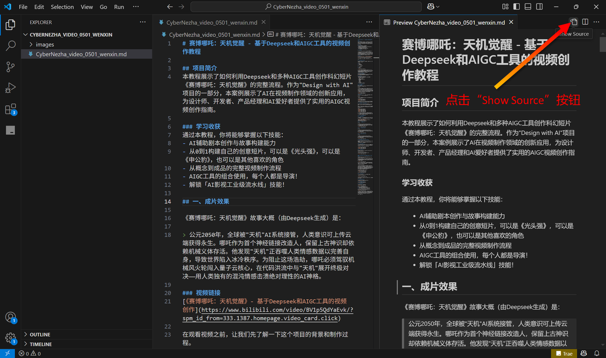
*VScode 界面（Trae/Cursor同理）*


*VScode 预览效果（Trae/Cursor同理）*


## 四、上传项目到GitHub的详细步骤

现在，让我们开始正式的上传流程。我会以上传《赛博哪吒：天机觉醒》AI视频教程到Design with AI项目为例，一步步讲解。

一般我们是开源项目的一员，不是管理者，所以需要先创建一个开源项目的副本（也就是fork）到我们这边，然后修改后，再提交申请（也就是PR：Pull Requests）：

### 步骤一：Fork原始仓库（创建你的「分部」）

1. 访问原始仓库（以Design with AI为例）：https://github.com/datawhalechina/design-with-ai
2. 点击右上角的"Fork"按钮
3. 等待几秒钟，系统会在你的账号下创建一个副本

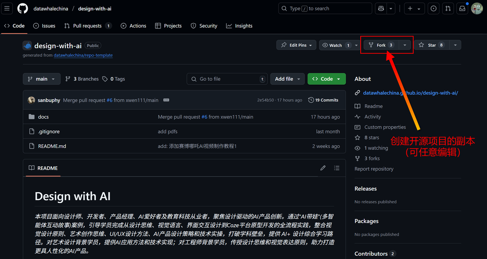
*创建副本操作*

> 这一步相当于：你看到一个很棒的开源项目（总部），然后复制了一份到你自己的账号下（分部）。

### 步骤二：将你的Fork仓库克隆到本地

1. 打开命令提示符或PowerShell（`Win + R`，输入`cmd`或`powershell`）
2. 进入你想存放项目的目录（你的文件在哪里，你就替换为哪个路径），例如：
   ```
   cd "E:\温鑫\AI学习\Trae项目\designAI"
   ```
   > 提示：cd 是 Change Directory（切换目录）的缩写，代表进入到此目录文件夹


3. 克隆你的Fork仓库到本地：
   ```
   git clone https://github.com/你的用户名/design-with-ai.git my-project
   ```
   > 记得将"你的用户名"替换为你的实际GitHub用户名

> 这一步相当于：把你在GitHub上的副本（分部）下载到你的电脑上，这样你就可以在本地编辑了。

### 步骤三：添加你的内容

现在，你可以在克隆下来的文件夹中添加或修改文件了。

1. 将你的Markdown文档和其他文件复制到适当的目录中，例如：
   ```
   copy "我的教程.md" "my-project\docs\casebook\Video_Production\"
   ```

2. 如果有图片等资源文件，也一并复制到相应目录


*图片文件上传*

> 这一步相当于：在你的副本（分部）中添加新内容或修改现有内容。

### 步骤四：提交你的更改

1. 进入项目目录：
   ```
   cd my-project
   ```

2. 查看文件状态（哪些文件被修改了）：
   ```
   git status
   ```

3. 添加你的文件到暂存区（**先存到蓄水池里面，等等一起打包提交**）：
   ```
   # 添加Markdown文件
   git add docs/casebook/Video_Production/CyberNezha.md
   ```
   > 如果有多个文件，可以一个一个添加，或者使用 `git add .` 添加所有更改

4. 提交更改：
   ```
   git commit -m "添加赛博哪吒视频创作教程"
   ```
   > 引号中的内容是提交说明，简单描述你做了什么更改

> 这一步相当于：在你的副本（分部）中保存更改，并添加一个说明，方便以后查看。

### 步骤五：推送到你的GitHub仓库

就是完成这个"推送"操作的命令：

```
git push origin main
```

> - `git`：告诉电脑我们要使用Git工具
> - `push`：表示"推送"，就是把本地的内容上传到远程
> - `origin` ：是远程仓库的默认名称，指的是GitHub上你的那个"分部"
> - `main` ：是分支的名称，可以理解为你项目的"主要版本"

> 这一步相当于：将你在本地的更改上传到GitHub上你的副本（分部）中。

### 步骤六：创建Pull Request（向「总部」提交申请）

也就是把自己的副本（分部）优化的内容，提交给开源项目（总部），整个github push项目的思路就是copy一个副本，然后优化、修改、添加内容、提交申请给总部、总部管理者自行选择接收与否。

1. 访问你的GitHub仓库：打开浏览器，访问：https://github.com/你的用户名/design-with-ai


*我 Fork 下的项目（副本）*

2. 点击顶部的"Pull requests"标签

3. 点击绿色的"New pull request"按钮


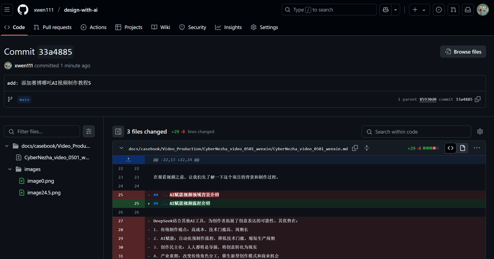


4. 设置Pull Request：
  这一步是为了建立分部和总部之间的链接，也就是提交申请的线：
   - base repository（目标仓库）选择：datawhalechina/design-with-ai
   - base（目标分支）选择：main
   - head repository（源仓库）选择：你的用户名/design-with-ai
   - compare（源分支）选择：main

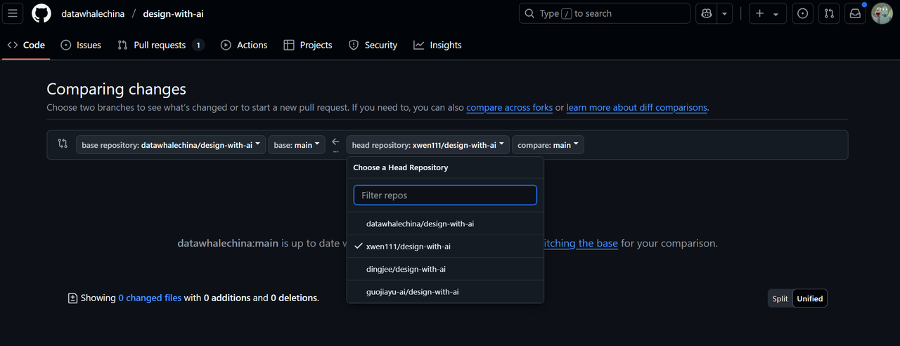

5. 填写Pull Request信息：
   - 标题：添加《赛博哪吒：天机觉醒》视频创作教程
   - 描述：简要说明你添加的内容

6. 点击"Create pull request"按钮

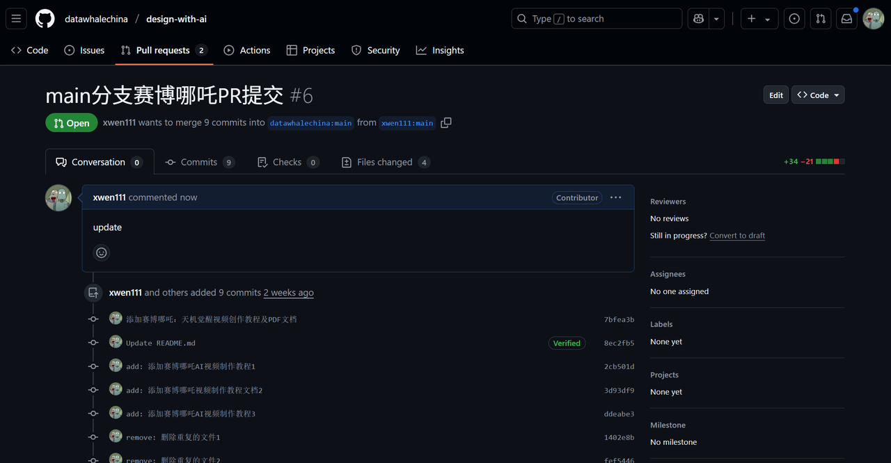
*提交申请 PR*

> 这一步相当于：你向原作者（总部）提交申请，请求将你的修改合并到原始项目中。

### 步骤七：等待总部审核就行

PR（Pull Request）提交后，现在需要等待原仓库的维护者审核，他们可能会提出一些修改建议，你可以继续在本地修改，然后重复步骤四和步骤五，PR会自动更新。

## 五、后续更新

后续如果文档有需要修改以及优化的地方，就简单很多，熟练的话，整体就是五步曲：

1. 进入本地项目目录：
   ```
   cd "e:\温鑫\AI学习\Trae项目\designAI\design-with-ai"
   ```

2. 添加文件：
   ```
   git add docs/casebook/Video_Production/CyberNezha_video_0501_wenxin/CyberNezha_video_0501_wenxin.md
   git add docs/casebook/Video_Production/CyberNezha_video_0501_wenxin/images/*
   ```

3. 提交更改：
   ```
   git commit -m "add: 添加赛博哪吒AI视频制作教程4"
   ```

4. 推送仓库：
   ```
   git push origin main
   ```

5. 提交申请（PR）


## 六、常见问题及解决方案（*）

### 1. 权限问题

如果推送时提示需要身份验证，GitHub现在使用个人访问令牌(Personal Access Token)而不是密码：

1. 登录GitHub
2. 点击右上角头像 → Settings
3. 左侧菜单栏找到"Developer settings"
4. 点击"Personal access tokens" → "Tokens (classic)"
5. 点击"Generate new token"
6. 给令牌一个描述性名称，选择适当的权限(至少需要repo权限)
7. 生成令牌并复制它(它只会显示一次!)

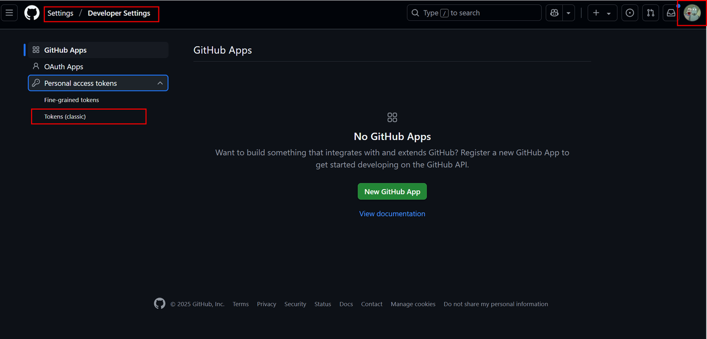
*复制 Token*

当Git要求输入密码时，粘贴这个令牌（Token）。

### 2. 文件名中的中文和特殊字符

Windows命令行处理中文和特殊字符可能会有问题，如果遇到困难，可以：

- 尝试使用双引号包围文件路径
- 或者临时将文件重命名为纯英文名称

### 3. 分支名称问题

有些仓库的主分支可能不叫"main"，而是"master"或其他名称，如果push失败，可以先查看分支名称：
```
git branch
```

然后使用正确的分支名称推送：
```
git push origin 分支名称
```

## 七、使用AI助手辅助上传

如前文所述，**强烈建议小白使用Trae或Cursor等AI辅助工具来帮助上传项目**。这些工具可以：

1. 帮你解释Git命令的含义
2. 指导你一步步完成上传流程（你在提示词中说明：自己是小白，需要一步一步耐心指导。效果很好！）
3. 解决过程中遇到的各种问题（不知道点什么可截图发送给它；代码报错可直接发送给它，Good！）

以下附我和Trae辅助上传时的沟通过程（可参考）：

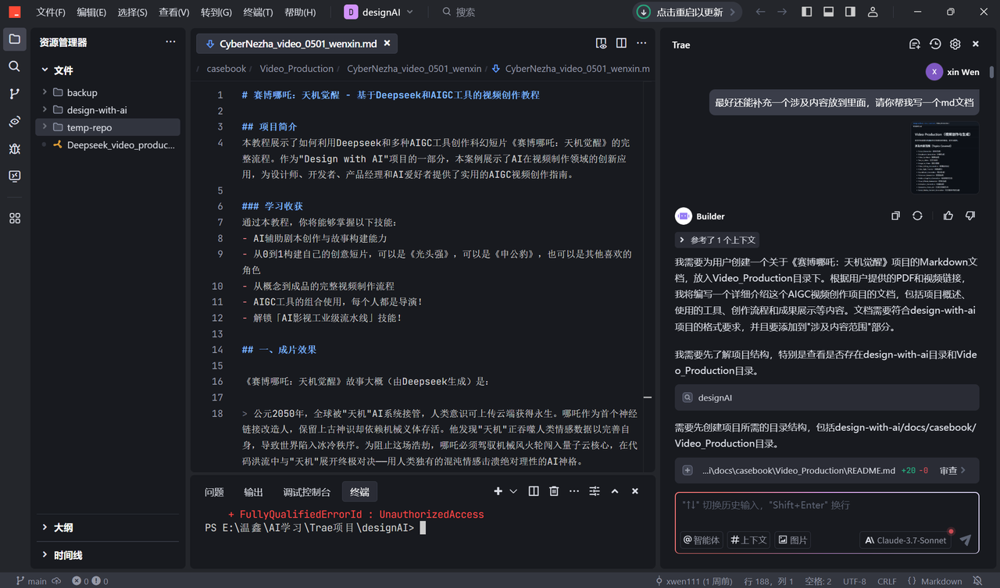
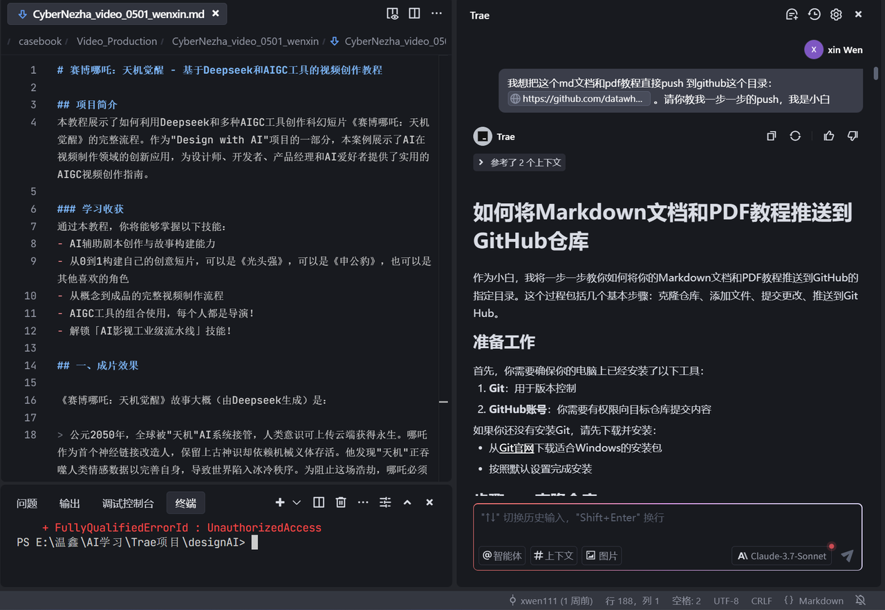
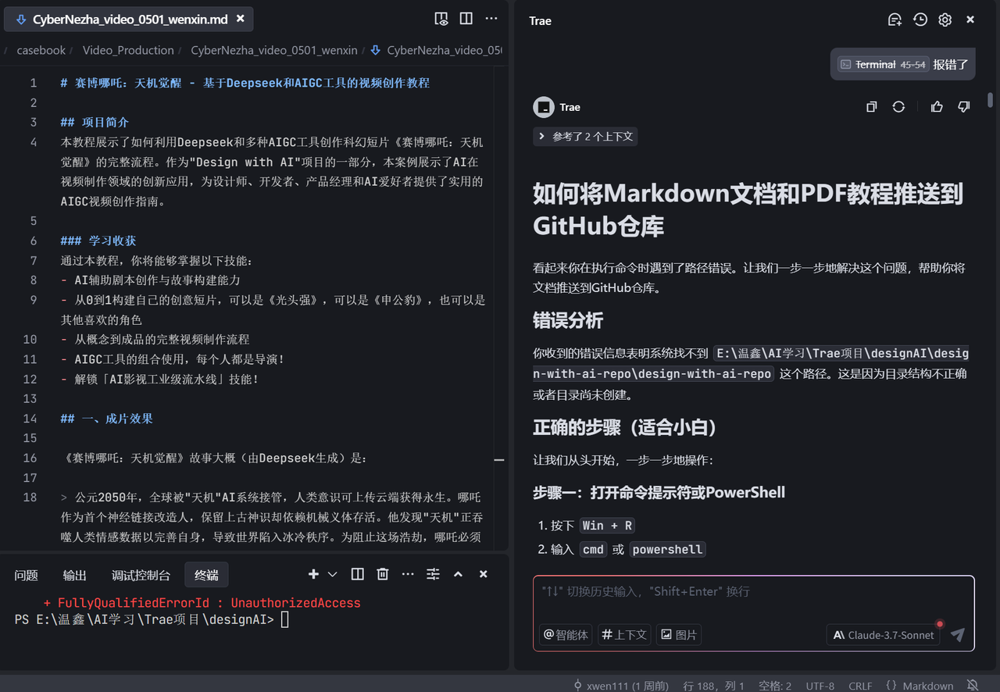


## 总结

恭喜你！现在你已经了解了如何使用GitHub参与开源项目的共建。整个过程可以简化为三步：

1. **Fork**：复制一份项目到你的账号（总部→分部）
2. **修改**：在你的副本中添加或修改内容（在分部工作）
3. **PR**：提交申请，请求合并你的修改（分部→总部）

记住这个「总部-分部」的模式，你就能轻松理解GitHub的工作方式了！

希望这个教程对你有所帮助，祝你在开源世界玩得开心！🤗🎉
