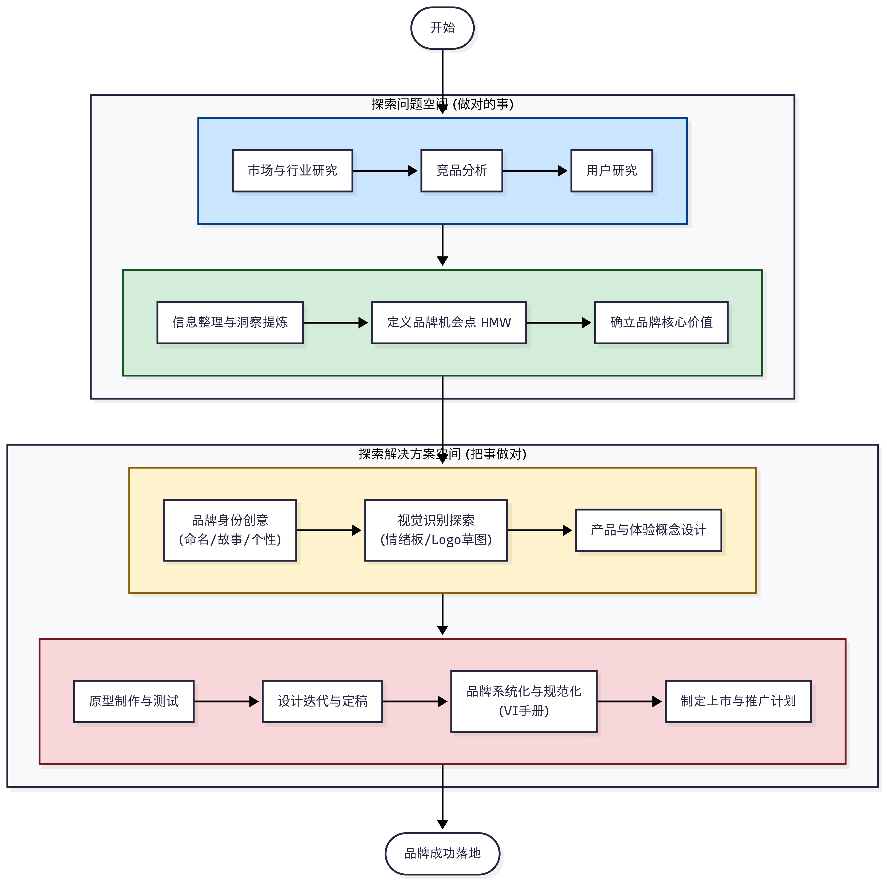
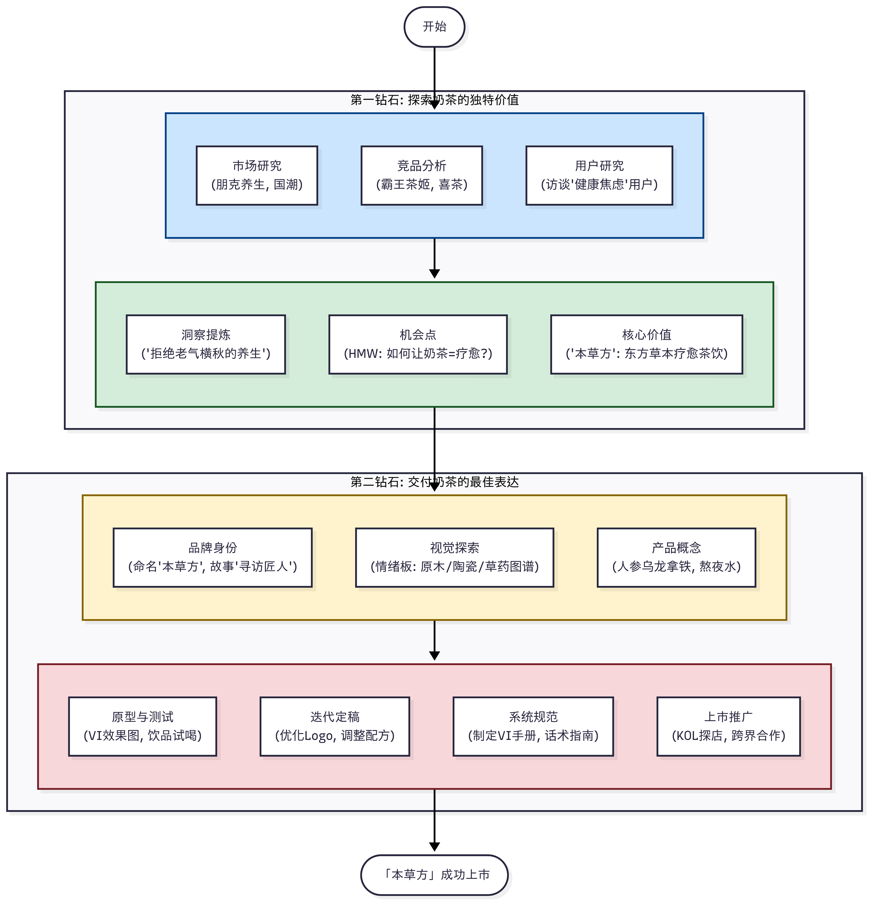
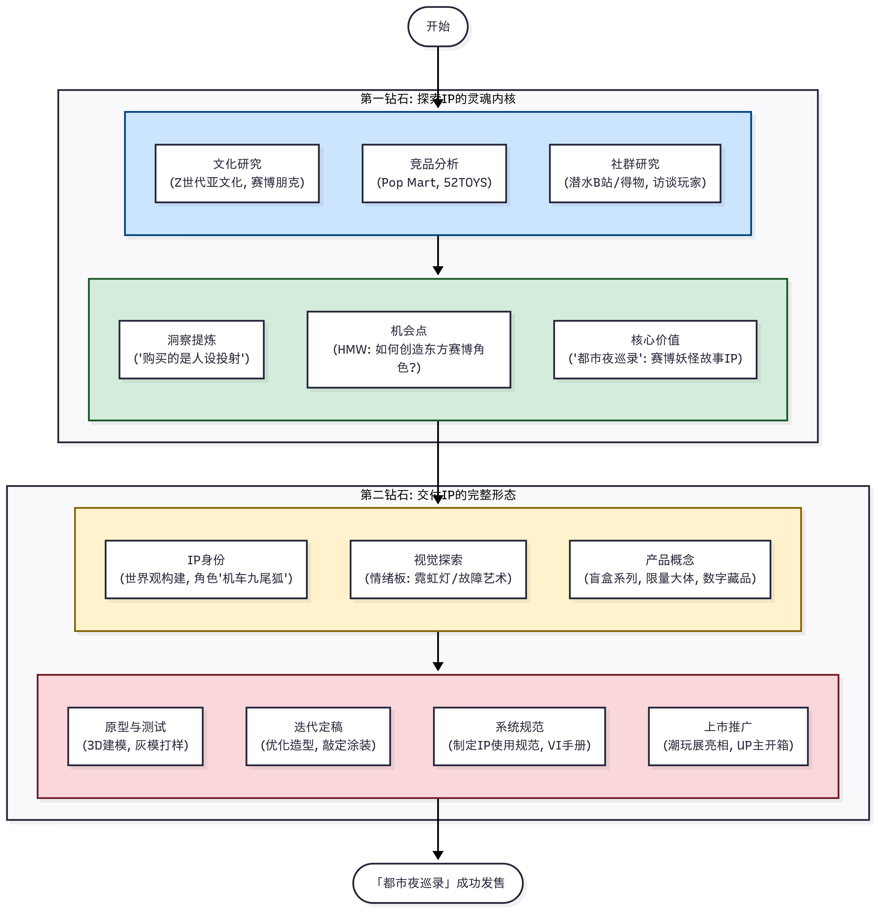
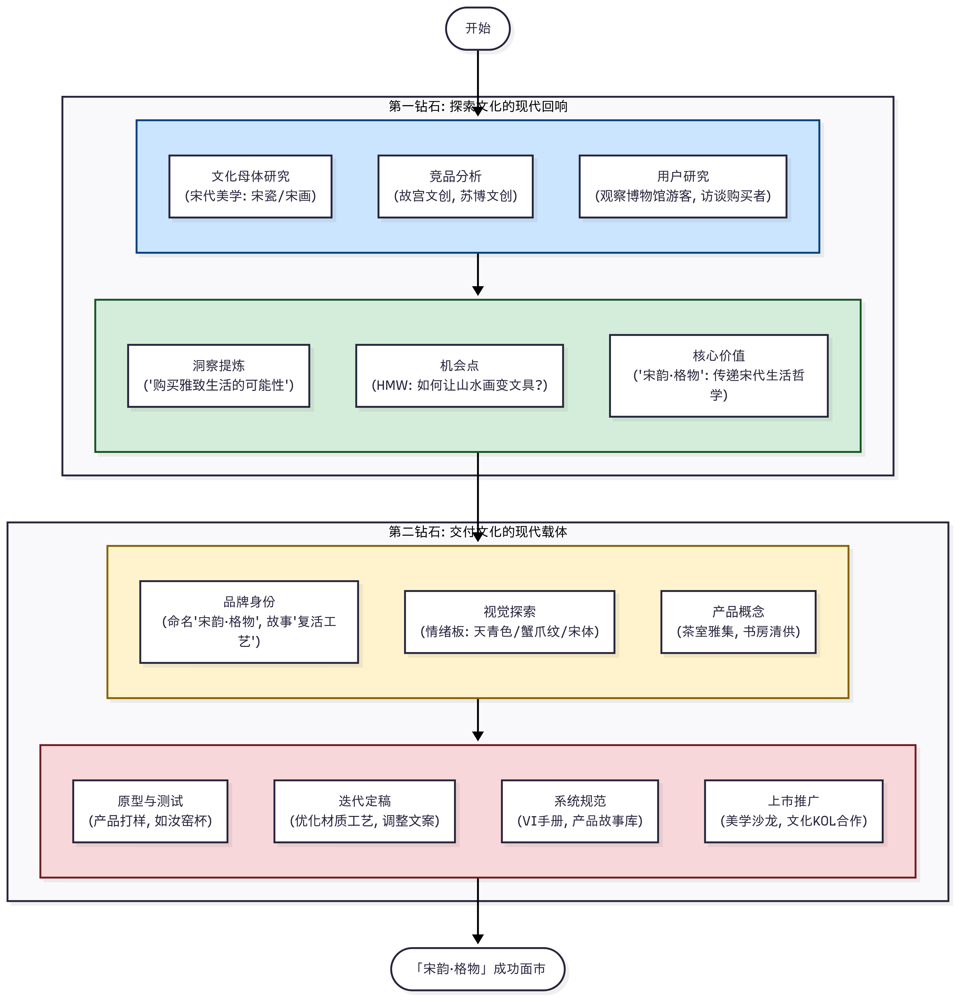
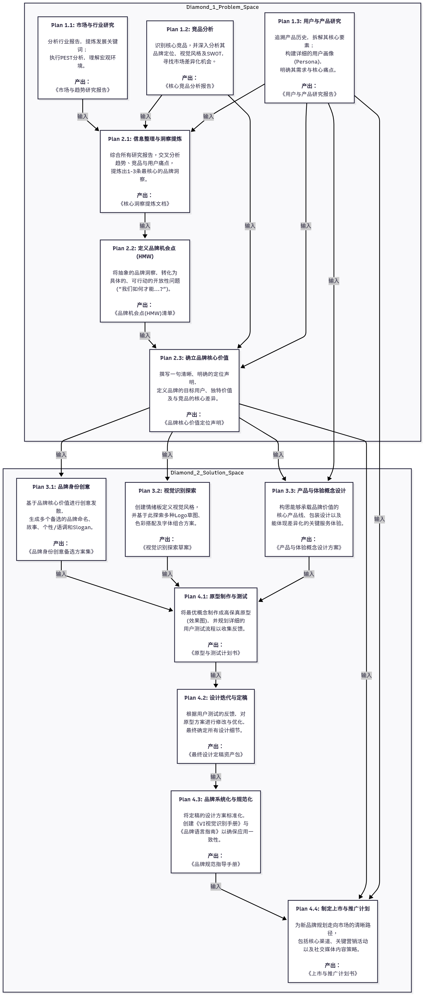

# **AI协助品牌设计：基于双钻模型的实战指南 系列一：调研框架**

在当今竞争激烈的市场中，一个强大而独特的品牌是成功的基石。然而，品牌设计并非仅仅是画一个漂亮的Logo，它是一个系统性的价值发现与创造过程。本文将为您详细拆解如何运用经典的**双钻设计模型（Double Diamond Model）**，并结合AI工具，一步步构建一个深入人心的品牌。

我们将首先建立一个**通用的品牌设计核心框架**，包含其方法论和行动计划。随后，我们将把这个通用框架分别应用到**奶茶、潮玩、文创**三个热门领域，进行分场景的详细实战演练，向您展示如何将理论完美落地。

---

## **核心框架：品牌设计的通用范式与行动计划**

### **理论基础：双钻模型 (Double Diamond Model)**

双钻模型是所有现代设计流程的基石。它将复杂的创意过程分解为四个清晰的阶段，形成两个“钻石”形状的思维模式：**先发散探索，再收敛聚焦**。

*   **第一个钻石（探索问题空间）：做对的事 (Doing the Right Thing)**
    *   **Discover (发现 - 发散):** 在这个阶段，我们要像海绵一样，尽可能广泛地吸收信息，探索一切可能性，深入理解用户、市场和宏观环境。目标是“打开视野”，而非过早下结论。
    *   **Define (定义 - 收敛):** 在此阶段，我们将发现阶段收集到的海量信息进行分析、归纳和提炼，从而精准地定义出品牌需要解决的核心问题和独特的市场机会点。目标是“找准靶心”。

*   **第二个钻石（探索解决方案空间）：把事做对 (Doing Things Right)**
    *   **Develop (发展 - 发散):** 基于已经明确定义的问题，我们再次展开想象的翅膀，进行大规模的创意风暴，产出尽可能多的潜在解决方案，包括品牌命名、故事、视觉概念等。
    *   **Deliver (交付 - 收敛):** 这是将创意落地的阶段。通过原型制作、用户测试和不断迭代，我们从众多方案中筛选并打磨出最优解，最终形成一套完整、规范的品牌系统，并规划其上市路径。

### **通用行动计划 (General Action Plan)**

以下是基于双钻模型的通用品牌设计行动计划，它构成了我们后续所有实践的基础。

#### **第一钻石：探索与定义“品牌的独特价值”**

**第一阶段：Discover (发现 - 探索市场与用户)**

*   **目标：** 深入理解宏观环境、竞争格局和用户的深层需求，收集一切相关信息。
*   **通用行动计划:**
    1.  **市场与行业研究 (Market Research):** 分析宏观环境(PEST)、行业规模、增长率及关键趋势。
    2.  **竞品分析 (Competitor Analysis):** 识别直接与间接竞品，分析其品牌定位、产品策略、视觉形象、营销沟通及优劣势(SWOT)。
    3.  **用户研究 (User Research):** 定义初步的目标用户画像，通过定性（访谈）和定量（问卷）方法深入了解用户，产出用户画像(Persona)和同理心地图(Empathy Map)。

**第二阶段：Define (定义 - 提炼洞察与核心价值)**

*   **目标：** 将海量信息进行分析、归纳，提炼出清晰的洞察，并精准定义品牌的核心价值。
*   **通用行动计划:**
    1.  **信息整理与洞察提炼 (Synthesize Insights):** 使用亲和图等方法聚合信息，从中提炼出核心洞察。
    2.  **定义品牌机会点 (Frame the Opportunity):** 使用“我们如何才能...?” (How Might We...?) 的句式将问题转化为机会。
    3.  **确立品牌核心价值 (Define Core Value Proposition):** 撰写一句清晰的品牌定位声明，明确品牌的独特性。

#### **第二钻石：探索与交付“品牌的最佳表达”**

**第三阶段：Develop (发展 - 创意发散)**

*   **目标：** 基于品牌核心价值，进行品牌身份、视觉和体验的多元化创意发散。
*   **通用行动计划:**
    1.  **品牌身份创意 (Brand Identity Brainstorming):** 头脑风暴品牌命名、品牌故事、品牌个性/语调和Slogan。
    2.  **视觉识别探索 (Visual Identity Exploration):** 制作情绪板(Mood Board)，绘制大量Logo草图，探索色彩和字体方案。
    3.  **产品与体验概念设计 (Product & Experience Concept):** 规划产品线，构思包装设计和空间/服务体验概念。

**第四阶段：Deliver (交付 - 测试与落地)**

*   **目标：** 将最佳概念打磨成最终成品，并制定完整的品牌规范和推广计划。
*   **通用行动计划:**
    1.  **原型制作与测试 (Prototyping & Testing):** 制作视觉、产品或服务原型，并邀请目标用户进行测试以获取反馈。
    2.  **设计迭代与定稿 (Refine & Finalize):** 根据测试反馈，对选定的方案进行修改、优化并最终定稿。
    3.  **品牌系统化与规范化 (Systematize & Guideline):** 创建品牌视觉识别系统手册(VI Guideline)和品牌语言指南(Tone of Voice Guideline)。
    4.  **制定上市与推广计划 (Launch & Marketing Plan):** 制定上市策略、营销活动和内容规划。

---

## **场景一：新中式草本奶茶品牌设计 (套用框架)**

> **场景概述：** 市场趋于饱和，但“健康化”、“养生”成为新的消费趋势。我们需要打造一个既满足口腹之欲，又能提供情绪价值和健康慰藉的奶茶品牌。

### **第一钻石：探索与定义“品牌的独特价值”**

#### **第一阶段：Discover (发现 - 探索市场与用户)**

*   **目标：** 深入理解奶茶市场的宏观趋势、竞争格局和消费者的深层需求。
*   **行动计划 (Action Plan):**
    1.  **市场与行业研究 (Market Research):**
        *   **宏观分析(PEST):** 分析政策（健康中国）、经济（消费升级）、社会（国潮兴起、朋克养生）、技术（线上点单）的影响。
        *   **行业趋势:** 锁定“健康茶饮”赛道，研究其“草本添加”、“无糖/低糖”等趋势。
    2.  **竞品分析 (Competitor Analysis):**
        *   **直接竞品:** 喜茶（高端社交）、霸王茶姬（新中式）。
        *   **间接竞品:** 咖啡品牌（星巴克）、传统凉茶铺（王老吉）。
        *   **机会点:** 发现将“东方草本疗愈”理念做深、做透、做得时尚的品牌仍是蓝海。
    3.  **用户研究 (User Research):**
        *   **初步画像:** 20-35岁的都市白领，关注健康但戒不掉奶茶。
        *   **深度访谈:** 提问：“喝奶茶时有什么‘罪恶感’吗？”
        *   **产出Persona:** “小林，28岁，广告人”，她常熬夜，渴望精神慰藉但又担心发胖，追求有设计感和故事性的消费。

#### **第二阶段：Define (定义 - 提炼洞察与核心价值)**

*   **目标：** 将海量信息收敛，精准定义品牌的核心价值与要解决的问题。
*   **行动计划 (Action Plan):**
    1.  **信息整理与洞察提炼 (Synthesize Insights):**
        *   **核心洞察:** “当代年轻人并非拒绝养生，而是拒绝老气横秋的养生方式。他们渴望将健康理念无缝融入潮流、便捷的现代生活。”
    2.  **定义品牌机会点 (Frame the Opportunity):**
        *   **HMW:** “我们如何才能让喝奶茶像一次身心疗愈的迷你假期？”
    3.  **确立品牌核心价值 (Define Core Value Proposition):**
        *   **定位声明:** “为关注身心健康的都市年轻人，**「本草方 PURE HERB」**是一个新中式草本茶饮品牌，它将东方草本智慧与现代味蕾体验相结合，提供疗愈身心的健康饮品。不像其他奶茶品牌只关注口味，我们更注重真材实料的内在调养和宁静致远的品牌体验。”

### **第二钻石：探索与交付“品牌的最佳表达”**

#### **第三阶段：Develop (发展 - 创意发散)**

*   **目标：** 基于品牌核心价值，进行品牌身份和体验的创意发散。
*   **行动计划 (Action Plan):**
    1.  **品牌身份创意 (Brand Identity Brainstorming):**
        *   **命名:** 本草方、茶愈、一味。
        *   **故事:** “创始人寻访草药匠人，立志将古老配方带给都市同龄人”。
        *   **个性:** 智慧、温和、纯净。
        *   **Slogan:** “本草方，一口东方慢时光。”
    2.  **视觉识别探索 (Visual Identity Exploration):**
        *   **情绪板:** 原木、棉麻、陶瓷、草药图谱、宋代美学。
        *   **Logo草图:** 绘制大量不同风格的概念草图。
        *   **色彩/字体:** 主色为米白、原木色；字体为优雅的衬线体与简约的非衬线体组合。
    3.  **产品与体验概念设计 (Product & Experience Concept):**
        *   **产品线:** 核心系列（人参乌龙拿铁）、功能系列（熬夜水）。
        *   **包装:** 环保纸浆杯、草本压纹杯套、功效小卡片。
        *   **空间:** 现代药柜、都市茶室、疗愈实验室。

#### **第四阶段：Deliver (交付 - 测试与落地)**

*   **目标：** 将最佳概念打磨成最终方案，并制定完整的品牌规范和推广计划。
*   **行动计划 (Action Plan):**
    1.  **原型制作与测试 (Prototyping & Testing):**
        *   制作3个最优VI方案的效果图及核心饮品，邀请用户测试并收集反馈。
    2.  **设计迭代与定稿 (Refine & Finalize):**
        *   根据反馈优化Logo细节、调整饮品配方，最终确定所有设计。
    3.  **品牌系统化与规范化 (Systematize & Guideline):**
        *   创建详细的**VI手册**和**品牌语言指南**。
    4.  **制定上市与推广计划 (Launch & Marketing Plan):**
        *   **策略:** 旗舰店+线上外卖。
        *   **活动:** KOL探店、在小红书发起#办公室里的草本茶#话题、与瑜伽馆跨界合作。

---

## **场景二：原创IP潮玩品牌设计 (套用框架)**

> **场景概述：** 潮玩的核心是IP及其背后的情感连接与文化认同。设计需要从角色塑造和世界观构建出发，满足玩家的收藏、社交和精神寄托需求。

### **第一钻石：探索与定义“IP的灵魂内核”**

#### **第一阶段：Discover (发现 - 探索文化与社群)**

*   **目标：** 洞察当下年轻人的文化潮流、审美偏好和情感缺口，寻找创造新IP的机会。
*   **行动计划 (Action Plan):**
    1.  **市场与行业研究 (Market Research):**
        *   **宏观分析:** 研究Z世代的亚文化（赛博朋克、萌系）、IP衍生经济。
        *   **行业趋势:** 发现“陪伴感”和“情绪价值”是核心驱动力，“丧萌”、“反差感”性格设定受欢迎。
    2.  **竞品分析 (Competitor Analysis):**
        *   **直接竞品:** Pop Mart、52TOYS、寻找独角兽。
        *   **间接竞品:** 动漫/游戏IP周边（原神）、艺术家厂牌（KAWS）。
        *   **机会点:** 结合东方奇幻与赛博朋克元素的IP，或表达特定生活状态的IP，尚有市场空白。
    3.  **用户研究 (User Research):**
        *   **初步画像:** 18-30岁的潮流爱好者、ACG文化圈层用户。
        *   **研究方法:** **社群潜水**（在得物、B站观察讨论）、**深度访谈**资深玩家。
        *   **产出Persona:** “阿哲，22岁，大学生”，他通过潮玩表达个性和社交，看重IP的故事性和稀有度。

#### **第二阶段：Define (定义 - 提炼IP世界观与核心魅力)**

*   **目标：** 将文化洞察聚焦，定义出IP的核心世界观、角色性格和要传递的情感价值。
*   **行动计划 (Action Plan):**
    1.  **信息整理与洞察提炼 (Synthesize Insights):**
        *   **核心洞察:** “年轻人购买潮玩，买的是一个‘人设’的投射，一个‘故事’的入场券。IP需要提供一个可供想象的宇宙。”
    2.  **定义品牌机会点 (Frame the Opportunity):**
        *   **HMW:** “我们如何才能创造一个既有东方神秘感，又充满未来科技感的角色？”
    3.  **确立品牌核心价值 (Define Core Value Proposition):**
        *   **定位声明:** “为渴望在现实世界中找到精神寄托的年轻人，**「都市夜巡录」**是一个原创科幻国风IP潮玩品牌，它构建了一个赛博城市中的妖怪故事宇宙。不像其他萌系IP，我们通过‘酷与萌’的反差设计和强故事性，提供更具想象空间和收藏价值的情感体验。”

### **第二钻石：探索与交付“IP的完整形态”**

#### **第三阶段：Develop (发展 - 角色与产品创意)**

*   **目标：** 基于IP世界观，发散角色设计、产品形态和品牌视觉。
*   **行动计划 (Action Plan):**
    1.  **品牌身份创意 (Brand Identity Brainstorming):**
        *   **命名:** 「都市夜巡录」(IP名), 「SYNTH-SOUL」(品牌名)。
        *   **故事/角色:** 撰写世界观，设计“机车少女九尾狐”、“程序员河童”等角色。
        *   **Slogan:** “夜幕之下，灵魂觉醒。”
    2.  **视觉识别探索 (Visual Identity Exploration):**
        *   **情绪板:** 赛博朋克夜景、霓虹灯、故障艺术、妖怪绘卷。
        *   **Logo草图:** 设计兼具科技感和神秘感的Logo。
        *   **色彩/字体:** 深邃蓝紫、亮粉、荧光绿；未来感无衬线字体。
    3.  **产品与体验概念设计 (Product & Experience Concept):**
        *   **产品线:** 核心盲盒系列、隐藏款、限量大体、数字藏品。
        *   **包装:** 带有霓虹灯效、AR互动功能的盲盒包装。
        *   **衍生:** 手机壳、卫衣、滑板。

#### **第四阶段：Deliver (交付 - 打样与上市)**

*   **目标：** 将IP和产品从概念变为现实，并规划上市和社群运营。
*   **行动计划 (Action Plan):**
    1.  **原型制作与测试 (Prototyping & Testing):**
        *   进行**3D建模与3D打印**制作手办灰模，邀请核心玩家评测造型、涂装效果。
    2.  **设计迭代与定稿 (Refine & Finalize):**
        *   根据反馈调整角色动态、优化分模线，敲定最终方案。
    3.  **品牌系统化与规范化 (Systematize & Guideline):**
        *   创建**IP使用规范**和品牌**VI手册**。
    4.  **制定上市与推广计划 (Launch & Marketing Plan):**
        *   **策略:** 参与大型潮玩展亮相，与头部渠道合作发售。
        *   **活动:** 发布IP世界观动画短片、与UP主合作开箱、发起二创大赛。

---

## **场景三：博物馆文创品牌设计 (套用框架)**

> **场景概述：** 文创设计的核心是将厚重的历史文化进行“转译”，使其变得轻盈、有趣、并与现代生活方式相连接，需兼顾文化内核的准确性与产品的实用美观。

### **第一钻石：探索与定义“文化的现代回响”**

#### **第一阶段：Discover (发现 - 挖掘文化宝藏)**

*   **目标：** 深入研究馆藏文物或特定文化主题，挖掘其背后的故事、美学和象征意义。
*   **行动计划 (Action Plan):**
    1.  **市场与行业研究 (Market Research):**
        *   **文化母体研究:** 以“宋代美学”为例，深入研究宋瓷、宋画、宋代生活四艺。
        *   **行业趋势:** 发现宋代美学的“简约、雅致”与当下流行的“极简主义”有共通之处，具有高转译价值。
    2.  **竞品分析 (Competitor Analysis):**
        *   **直接竞品:** 故宫文创、苏州博物馆文创、国家宝藏IP。
        *   **间接竞品:** 独立设计师品牌（上下SHANGXIA）。
        *   **机会点:** 专注于呈现“宋代士人雅致生活美学”的系统性品牌尚有空间。
    3.  **用户研究 (User Research):**
        *   **初步画像:** 25-45岁的文艺爱好者、历史文化迷、追求生活品质的都市中产。
        *   **研究方法:** **博物馆现场观察**、**购买者访谈**。
        *   **产出Persona:** “静仪，35岁，茶艺师”，她购买文创是为了获得文化身份认同和生活仪式感。

#### **第二阶段：Define (定义 - 提炼文化IP与品牌主张)**

*   **目标：** 将繁杂的文化元素进行梳理，提炼出最核心、最能引发共鸣的文化符号和品牌主张。
*   **行动计划 (Action Plan):**
    1.  **信息整理与洞察提炼 (Synthesize Insights):**
        *   **核心洞察:** “消费者购买文创，是在购买一种‘雅致生活的可能性’。他们希望将博物馆里的美，轻松地带回日常。”
    2.  **定义品牌机会点 (Frame the Opportunity):**
        *   **HMW:** “我们如何才能将宋代的一幅山水画，变成书桌上的一方实用风景？”
    3.  **确立品牌核心价值 (Define Core Value Proposition):**
        *   **定位声明:** “为追求雅致生活与文化底蕴的现代人，**「宋韵·格物」**是一个源自宋代美学的文创品牌，它将馆藏文物的神韵与现代设计相融合，提供兼具实用与审美的生活器物。不同于贩卖符号的纪念品，我们致力于传递宋人‘格物致知’的生活哲学与艺术精神。”

### **第二钻石：探索与交付“文化的现代载体”**

#### **第三阶段：Develop (发展 - 产品与美学创意)**

*   **目标：** 基于“宋韵·格物”的定位，发散产品创意和品牌视觉体系。
*   **行动计划 (Action Plan):**
    1.  **品牌身份创意 (Brand Identity Brainstorming):**
        *   **命名:** 宋韵·格物、风雅宋。
        *   **故事:** 讲述品牌如何与当代匠人合作，复活失落的工艺之美。
        *   **个性:** 雅致、内敛、博学、温润。
        *   **Slogan:** “一器一物，皆有宋韵。”
    2.  **视觉识别探索 (Visual Identity Exploration):**
        *   **情绪板:** 天青色、蟹爪纹、宋代字画、极简园林。
        *   **Logo草图:** 从宋代窗格、瓷器轮廓、书法笔触中提取元素。
        *   **色彩/字体:** 提取汝窑天青、定窑牙白为主色；选用复刻宋体或秀丽楷体。
    3.  **产品与体验概念设计 (Product & Experience Concept):**
        *   **产品线:** 茶室雅集（茶具）、书房清供（文具）、四季风物（季节产品）。
        *   **包装:** 简约纸盒，附上介绍文物来源和文化故事的卡片。

#### **第四阶段：Deliver (交付 - 打磨与呈现)**

*   **目标：** 将文创产品精细打磨，并构建完整的品牌体验。
*   **行动计划 (Action Plan):**
    1.  **原型制作与测试 (Prototyping & Testing):**
        *   与手工艺人合作**产品打样**，制作小批量样品，测试材质、工艺和使用体验。
    2.  **设计迭代与定稿 (Refine & Finalize):**
        *   根据用户试用反馈，优化产品细节，如调整包装开启方式或文案措辞。
    3.  **品牌系统化与规范化 (Systematize & Guideline):**
        *   创建**VI手册**，确保所有物料传递一致的“宋韵”美学；创建**故事素材库**。
    4.  **制定上市与推广计划 (Launch & Marketing Plan):**
        *   **策略:** 博物馆商店+线上小程序商城+高端生活方式集合店。
        *   **活动:** 举办线下“宋代生活美学”体验沙龙、与文化类KOL合作深度内容种草。

## 借助智能体 Agent 思维模式化品牌设计

### 什么是智能体和 Plan

在前面的章节中，我们详细介绍了基于双钻模型的品牌设计通用框架，并通过奶茶、潮玩、文创三个领域的实战案例展示了如何将理论落地。然而，在实际的品牌设计过程中，我们往往面临着信息量庞大、决策复杂、需要多轮迭代的挑战。这时，**智能体（Agent）思维模式**为我们提供了一种全新的解决思路。

#### 智能体（Agent）的核心概念

**智能体（Agent）**就像一个很聪明的小助手，它能帮我们做品牌设计。想象一下，如果你要开一家奶茶店，这个小助手会帮你做这些事情：

1. **观察能力（就像用眼睛看）：** 小助手会到处看看，了解现在大家都喜欢什么样的奶茶店，哪些店生意好，顾客喜欢什么颜色和装修风格
2. **思考能力（就像用脑子想）：** 小助手把看到的信息整理好，然后想出一个完整的计划：店铺要什么颜色、Logo要什么样子、怎么吸引顾客
3. **动手能力（就像用手做）：** 小助手会把想法变成真的东西，比如画出Logo、设计店铺装修图、写宣传文案
4. **学习能力（就像会总结经验）：** 如果顾客说Logo不好看，或者某个颜色不受欢迎，小助手会记住这些意见，下次做得更好

我们可以借助智能体的行为方式来指导我们进行品牌设计，实际上人的设计过程也大差不差。

#### 品牌设计 Agent 串行工作流计划 (纯中文范本)

以下是基于智能体思维模式设计的品牌设计工作流计划，它将双钻模型的四个阶段进一步细化为可执行的具体计划步骤。每个计划都明确定义了输入、处理过程和输出，确保整个品牌设计过程既系统化又可追溯。

以下计划中的每个步骤，你既可以通过传统的调研方法手动执行，也可以借助 AI 工具来提升信息收集和分析的效率：

**第一钻石：探索问题空间 (做对的事)**

**第一阶段：Discover (发现)**

**计划 1.1: 市场与行业研究**

此计划旨在捕捉项目所处的宏观背景与行业风向。请搜索 [所属行业] 的最新市场研究报告与发展趋势预测，综合内容后提炼并总结出5个核心发展关键词（例如，为"智能宠物喂食器"项目总结出：AI健康监测、订阅制服务、环保材料、人宠交互、数据化喂养）。接着，通过搜索特定市场的 PEST 分析资料以及影响该行业的社会、技术因素，完成一份详尽的 PEST 分析报告。

*   **输入：** 一份包含 [待设计项目] 和 [所属行业] 的 项目初始简报。
*   **输出：** 一份完整的 《市场与趋势研究报告》，其中包含 PEST分析图 和 行业发展核心关键词列表。

**计划 1.2: 竞品分析**

此计划旨在明确市场的竞争格局，找到潜在的差异化空间。Agent 需要识别并列出 [待设计项目] 的3-5个核心直接与间接竞争对手。对每一个竞品，Agent 需分别搜索其官方网站、近期新闻、用户评测等，以分析其品牌定位、核心产品策略、视觉形象（VI）、市场营销案例，并总结其优劣势（SWOT）。例如，为"智能宠物喂食器"项目分析：竞品A (小佩) 定位"宠物界的苹果"，关键词为设计感、生态联动；竞品B (霍曼) 定位"稳定可靠的喂养专家"，关键词为防卡粮、长效保鲜。

*   **输入：** 一份包含 [待设计项目] 的 项目初始简报。
*   **输出：** 一份图文并茂的 《核心竞品分析报告》，其中包含对每个竞品的 品牌定位、视觉风格、优劣势(SWOT)分析 等内容的详细拆解。

**计划 1.3: 用户与产品研究**

此计划旨在深入理解产品的本质属性和其核心用户的真实世界。Agent 需要执行两项核心任务：首先，进行产品历史与要素调研，根据项目类型进行针对性溯源（例如，文创需调研地方志、地方统一的文化符号、习俗；个人品牌需调研其成长经历与喜好（教育、衣食住行、文化欣赏倾向性格等）；餐饮需调研产地文化与原材料、供应链情况）。其次，进行用户研究，搜索 [待设计项目] 的目标用户画像、消费行为洞察，并整合所有信息，构建一个或多个包含个人信息、目标动机、使用场景、痛点等细节的完整用户画像(Persona)。

*   **输入：** 一份包含 [待设计项目] 的 项目初始简报。
*   **输出：** 一份深度整合的 《用户与产品研究报告》，其中包含 产品历史与要素拆解 和 详细的用户画像档案。

**第二阶段：Define (定义)**

**计划 2.1: 信息整理与洞察提炼**

此计划旨在将前期收集的海量信息进行收敛，提炼出真正有价值的洞察。Agent 需要对前三个计划的输出报告进行综合交叉分析，特别是对比"趋势关键词"、"竞品劣势"和"用户痛点"，从中寻找模式、矛盾点和未被满足的需求。最终，总结出1-3条最核心、最深刻的品牌洞察。例如，洞察："用户购买智能喂食器，买的不仅是'自动化'，更是'不在场时的安心感'。现有产品普遍强调功能，但缺乏情感连接和信任感塑造。"

*   **输入：** 《市场与趋势研究报告》、《核心竞品分析报告》、《用户与产品研究报告》。
*   **输出：** 一份简明扼要的 《核心洞察提炼文档》，其中包含1-3条清晰的品牌洞察描述。

**计划 2.2: 定义品牌机会点 (HMW)**

此计划旨在将抽象的洞察转化为具体、可行动的设计问题。Agent 需要将上一步提炼出的每一条核心洞察，都转化为一个或多个以"我们如何才能...?" (How Might We...?) 句式提出的开放性问题。例如，针对"安心感缺失"的洞察，转化为："我们如何才能设计一款产品，让主人即使在断电断网的极端情况下，也对爱宠的饮食100%放心？"

*   **输入：** 《核心洞察提炼文档》。
*   **输出：** 一份 《品牌机会点(HMW)清单》，其中包含一系列以"我们如何才能...?"句式提出的问题。

**计划 2.3: 确立品牌核心价值**

此计划旨在为整个品牌设计工作立下"宪法"。Agent 需要调用品牌定位声明模板，并基于前序计划的所有结论，特别是 品牌机会点(HMW)清单，来撰写一句清晰、明确、具有差异化优势的品牌核心价值定位声明。声明需要明确目标用户、市场品类、独特价值，并点出与主要竞争对手的核心不同。

*   **输入：** 《品牌机会点(HMW)清单》、《核心竞品分析报告》、《用户与产品研究报告》。
*   **输出：** 一份 《品牌核心价值定位声明》 文档，其中包含一段最终确立的定位声明文本。

**第二钻石：探索解决方案空间 (把事做对)**

**第三阶段：Develop (发展)**

**计划 3.1: 品牌身份创意**

此计划旨在为品牌注入灵魂与个性。Agent 需要基于已确立的品牌核心价值，进行创意发散，生成多个备选的品牌身份元素，包括：品牌命名、品牌故事、品牌个性/语调、以及品牌口号(Slogan)。例如，为"Pawsitive Pal"品牌构思故事："创始人因一次出差时家中喂食器故障，爱宠饿了一天的焦虑经历，从而立志打造一款'绝对可靠、充满爱意'的喂食器……"

*   **输入：** 《品牌核心价值定位声明》。
*   **输出：** 一份 《品牌身份创意备选方案集》，其中包含 命名、故事、个性、Slogan 的多个备选方案。

**计划 3.2: 视觉识别探索**

此计划旨在将抽象的品牌个性转化为具象的视觉语言。Agent 首先需要根据品牌个性关键词创建情绪板(Mood Board)。然后，基于情绪板的风格，进行大量的创意构思，生成多种风格的 Logo 草图、探索多个色彩搭配方案和字体组合方案。例如，为"Pawsitive Pal"品牌探索色彩方案：主色为暖米白（#F5F5DC），象征家的温馨；辅助色为治愈的活力橙（#FFA500），象征宠物的活力与健康。

*   **输入：** 《品牌身份创意备选方案集》 (特别是其中关于 品牌个性 的描述)。
*   **输出：** 一份 《视觉识别探索草案》，其中包含 情绪板、Logo概念草图、色彩搭配方案 和 字体组合方案。

**计划 3.3: 产品与体验概念设计**

此计划旨在设计能够承载品牌核心价值的具体产品与服务。Agent 需要构思与品牌定位和用户核心需求相符的核心产品线、包装设计概念，以及能够体现品牌差异化的关键服务/空间体验概念。例如，为"Pawsitive Pal"品牌设计服务体验：App内设置"伙伴日志"功能，用拟人化语气报告每日喂食情况，并附上AI抓拍的宠物萌照，以增强情感连接。

*   **输入：** 《品牌核心价值定位声明》、《用户与产品研究报告》 (特别是其中关于 用户需求与痛点 的部分)。
*   **输出：** 一份 《产品与体验概念设计方案》，其中包含对 核心产品线、包装设计 和 关键服务体验 的初步构思。

**第四阶段：Deliver (交付)**

**计划 4.1: 原型制作与测试**

此计划旨在将最佳概念具体化并进行验证。Agent 需要从第三阶段产出的众多概念中，筛选出1-2个最有潜力的组合方案，并将其制作成高保真的视觉效果图或数字原型。同时，需要规划一个完整的用户测试流程，明确测试目标和需要向用户提问的关键问题，以收集有效反馈。

*   **输入：** 《品牌身份创意备选方案集》、《视觉识别探索草案》、《产品与体验概念设计方案》。
*   **输出：** 一份 《原型与测试计划书》，其中包含 筛选出的最优概念原型（效果图） 和一份详细的 用户测试执行方案。

**计划 4.2: 设计迭代与定稿**

此计划旨在根据用户反馈，对设计方案进行最终的优化与确认。Agent 需要（模拟或真实地）分析上一步测试计划可能带来的反馈，并基于这些反馈对原型方案进行修改与迭代。最终，确定所有设计的最终版本，包括品牌身份、视觉元素和产品体验细节。

*   **输入：** 《原型与测试计划书》。
*   **输出：** 一份 《最终设计定稿资产包》，其中包含所有最终确认的设计元素的规格和文件。

**计划 4.3: 品牌系统化与规范化**

此计划旨在将最终的设计方案标准化，以确保未来应用的一致性。Agent 需要基于定稿的设计资产，创建两份核心的品牌规范文件：一份是《品牌视觉识别系统手册》(VI Guideline)，详细规定Logo、色彩、字体等的使用规范；另一份是《品牌语言指南》(Tone of Voice Guideline)，规范品牌对外沟通的个性和语调。

*   **输入：** 《最终设计定稿资产包》。
*   **输出：** 一份 《品牌规范指导手册》 的压缩包，其中包含 VI手册.pdf 和 品牌语言指南.pdf 两个文件。

**计划 4.4: 制定上市与推广计划**

此计划旨在为新品牌走向市场规划清晰的路径。Agent 需要基于最终确立的品牌形象、定位和用户画像，规划品牌的上市策略，并制定一份初步的营销推广计划。计划应包括核心渠道的选择、关键上市活动的设计，以及社交媒体的内容方向。例如，发起#最安心的宠物伙伴#话题挑战，并与流浪动物救助机构合作公益活动。

*   **输入：** 《品牌核心价值定位声明》、《用户与产品研究报告》、《品牌规范指导手册》。
*   **输出：** 一份完整的 《上市与推广计划书》 文档。

## 结束语

以上为品牌设计的完整框架体系。在后续章节中，我们将深入展示每个环节的具体执行过程，并详细介绍如何运用各类AI工具（包括智能搜索、图像生成等）来高效完成品牌设计任务。敬请期待～