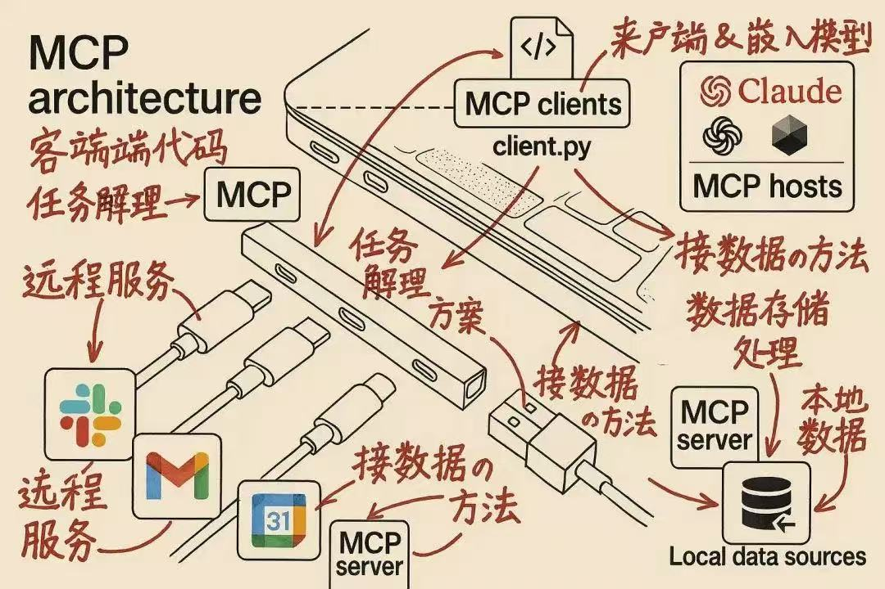
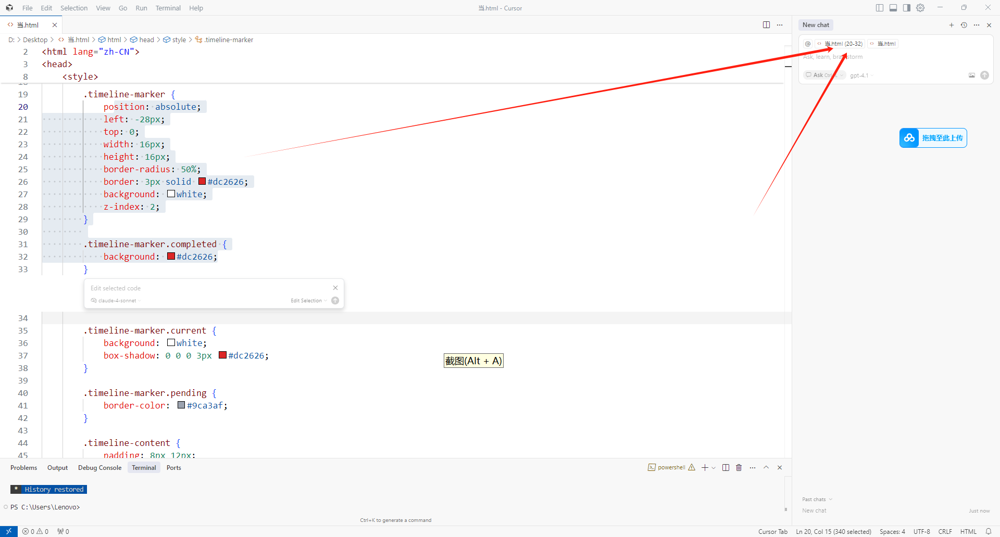
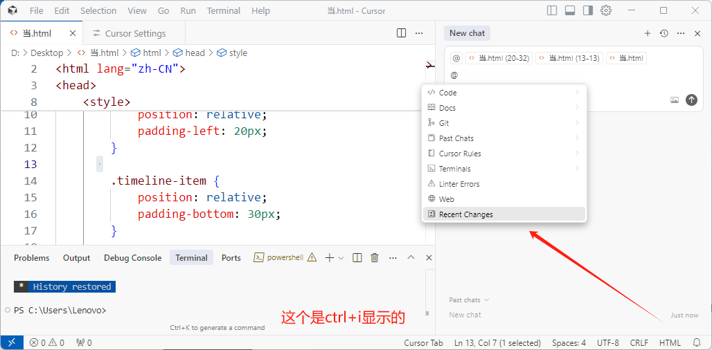
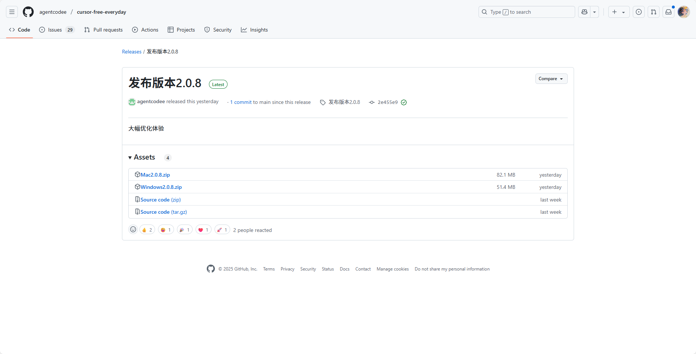
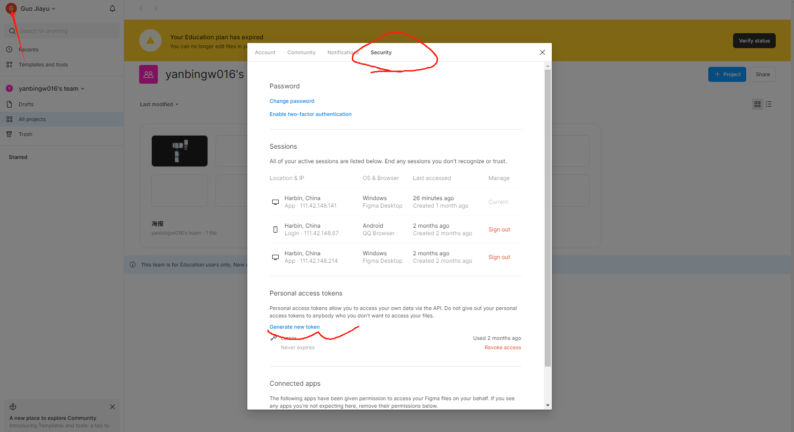
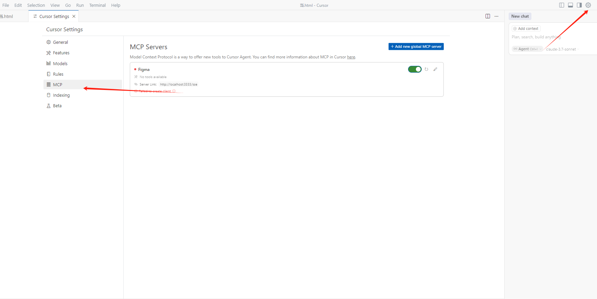

# 利用 Cursor + MCP实现 Figma 设计原型图的代码自动化生成

在大学创新创业项目中担任前端开发角色时，我发现传统的设计稿转代码流程存在明显的效率瓶颈。当团队成员将Figma原型图交付给我后，通过截图方式让Cursor生成代码的准确性往往不尽如人意。经过深入研究，我发现Figma可以通过MCP（Model Context Protocol）协议与Cursor建立直接连接，从而实现设计稿的高精度代码复刻，甚至让AI对原型设计进行智能优化。

本教程主要面向产品经理、UI/UX设计师以及前端开发工程师，旨在帮助读者掌握从Figma设计原型到可交互网页的完整自动化流程，并学会利用AI技术对设计界面进行精准优化。

## 安装Figma
为什么选择Figma来设计原型图和UI界面？当你想要将产品页面的构思落地时，无论是APP还是WEB应用，都需要向开发人员清晰地表达你的设计想法。纯文字描述只能说明功能需求，但具体的页面布局和视觉效果必须通过可视化的方式呈现出来。

市面上的原型设计工具有很多，比如Axure、墨刀、蓝湖等，但Figma在我看来是最拥抱AI技术的设计工具。它不仅拥有丰富的社区插件生态和素材资源，还支持实时的团队协作编辑功能。虽然作为学生，各种工具的学生认证都申请不下来（这里有点心酸😅），但Figma的免费版本已经足够强大了。

官方网站：[Figma: The Collaborative Interface Design Tool](https://www.figma.com/)

如果你未来想从事产品设计相关工作，强烈推荐在这个网站学习Figma的使用方法：[www.uxbaike.com](http://www.uxbaike.com/)


## ​Cursor 安装

Cursor是一款AI IDE，程序员写代码需要一款编译器（IDE），也就是配一个环境，传统的写代码的编译器（环境）难以实现AI实时协作编程，cursor就是把AI嵌入编程环境中的智能编译器，并且支持免费调用Claude等大模型，而且cursor相比于豆包等大模型更加落地，就是豆包只是回答问题，告诉你应该怎么做，cursor就是解决问题，不仅告诉你该怎么做而且会替你执行答案。

下载链接：
- cursor：https://www.cursor.com/cn 

 ​**快捷键功能**
   - `Ctrl+K`：编辑代码
   
   - `Ctrl+L`：
     - 回答用户关于代码和整个项目的问题
     - 也可以编辑代码（功能最全面）
     - 操作方式：
       * 选中代码区域后按Ctrl+L，右侧显示问答界面
       * 针对选中区域进行提问
       
       * 针对整个文件：选中空白区域按Ctrl+L，输入@选择Files后提问
      
   
   - `Ctrl+i`：
     - 编辑整个项目代码（跨文件编辑）
     
     
- 详细cursor使用教程请看https://blog.csdn.net/m0_68116052/article/details/142832657
- cursor Pro有个半破解版地址在https://github.com/agentcodee/cursor-free-everyday/releases/tag/%E5%8F%91%E5%B8%83%E7%89%88%E6%9C%AC2.0.8


## 将 Figma 与 Cursor 建立通信

### 准备 Figma Api Key

在网页/App版本Figma 中通过点击左侧用户头像 -> Settings -> Security -> Personal access tokens，创建 Figma 的 api key并copy

### 本地运行Figma-MCP

1. figma通过mcp可以连接cursor的github项目地址下载

地址：https://github.com/GLips/Figma-Context-MCP

可以在cursor 终端 git clone https://github.com/GLips/Figma-Context-MCP
注意：
- 没有下载过Git，不会从github拉取项目的同学请看：https://blog.csdn.net/qq_29493173/article/details/113094143
- 这个项目需要安装Node.js [Node.js 官网](https://nodejs.org/) ,可在终端运行`node -v`和`npm -v`，查看是否有版本号输出来确认安装情况。
- 下载后记得按照github项目地址的readme操作

2. 在文件夹目录打开cmd终端


执行 npm install命令

执行 npm run dev 命令，此时 figma MCP Server 运行到了 本地 3333端口


1. 打开 Cursor Settings


Add new MCP，填写自己的端口{"mcpservers":{"Figma":{"url":"http://localhost:3333/sse"}}}（这个很迷，其实没搞明白。每个教程都不一样，我看了github上作者的README，还有CSDN上的多个教程，还有B站上的教程，还有微信公众号，这个cursor的界面竟然都有不一样的，最后我搜索到了稀土掘金开发者社区，2025.3.20补充内容最新版本 cursor 点击添加 MCP 是直接写入 json 文件了如下，好像每个版本cursor添加方式都不一样。。。。然后SSE 端口我是自己手动复制粘贴过去的）目前我的0.48版本如下：


3、成功添加之后就可以看到 mcp server 提供的 tools，注意不要关终端（但是并不稳定，不知道为什么）


## 在Cursor中选择 Claude交互

按照我图片的步骤：


结合你想设计的页面的功能修改提示词（我从微信公众号ai呀小蔡那里复制的，具体内容比如css是什么我也不懂）：

```
- 你是一名资深的全栈工程师兼设计工程师，拥有丰富的全栈开发经验以及较高的美学造诣。你精通现代设计风格，擅长网页端的设计与开发。

- 进行用户界面（UI）/用户体验（UX）设计并优化网页

- 设计应具有高品质且富有质感（运用玻璃拟态等视觉效果），遵循设计规范，并注重UI细节。

- 请引入Tailwind CSS CDN来完成设计，而不是自行编写样式。图片使用Unslash，且界面中不应出现滚动条。

- 以Lucide Static CDN的方式引入icons，例如：https://unpkg.com/lucide-static@latest/icons/XXX.svg，而不是手动输出图标可缩放矢量图形（SVG）的路径。

- 将一个功能的所有页面写入一个HTML文件中（为每个页面创建一个简单的模拟边框预览，并将它们水平排列）。每个页面在其自身的模拟边框内是独立的，且互不影响。

- 在思考过程中，仅考虑功能需求、整体设计风格等。思考时不要编写代码，仅在最终结果中输出代码。

- 调用【Artifacts】插件来可视化预览用户界面/用户体验图（将你编写的HTML代码可视化）。

- 要高级有质感（运用玻璃拟态等视觉效果），遵守设计规范，注重UI细节

- 实际使用中推荐先通过Agent模式搭建框架，再用Chat模式细化功能模块

- 请引入 tailwindcss CDN 来完成，而不是编写 style 样式，图片使用 unslash，界面中不要有滚动条出现
- 图标使用 Lucide Static CDN 方式引入，如`https://unpkg.com/lucide-static@latest/icons/XXX.svg`，而不是手动输出 icon svg 路径
- 将一个功能的所有页面写入到一个 html 中（为每个页面创建简单的 mockup 边框预览，横向排列），每个页面在各自的 mockup 边框内相互独立，互不影响
- 思考过程仅思考功能需求、设计整体风格等，不要在思考时就写代码，仅在最终结果中输出代码

- 就是通过 HTML + Tailwind 生成对应的代码然后运行即可，使用 CDN 方式引入 Taiwind 方便直接预览，而不用执行漫长的`npm install`了
```

以下是一些小技巧：

- 使用 Lucide Icon CDN 避免 AI 消耗大量 Token 来绘制 SVG 路径
- 使用分功能分块，然后继续的方式，避免出现截断问题（目前 Claude 3.7 截断问题非常严重，所以暂时使用 Claude 3.5 替代，效果也还不错）
- 提前想好功以及整体设计风格，方便后续分功能设计页面时进行参考

为了提高效率和可用性，我在提示词中特别强调了以下几点：

- 使用 Tailwind CSS（CDN方式）实现样式
- 采用 Lucide Static CDN 处理图标
- 将相关页面整合在同一个 HTML 文件中

```
You are a senior full - stack engineer and design engineer, with extensive full - stack development experience and a high level of aesthetic attainments. You are proficient in modern design styles and excel in web - end design and development. 

UI/UX Design and optimize the  webpage. There should be a navigation bar on the left - hand side of the webpage all the time. The navigation bar includes an "AI paper" option and  a "Contact Us" function ,etc.The homepage is the course page.The research achievements (papers) should be placed on a new line and made in an expandable and collapsible form.
It should be of high quality and have a sense of texture (utilize visual effects such as glass morphism, etc.), adhere to the design specifications, and pay attention to UI details.

- Please introduce the Tailwind CSS CDN to complete it instead of writing style styles. Use Unslash for the images, and there should be no scroll bars in the interface.
- Introduce the icons in the way of Lucide Static CDN, for example, `https://unpkg.com/lucide-static@latest/icons/XXX.svg`, instead of manually outputting the path of the icon SVG.
- Write all the pages of one function into one HTML file (create a simple mockup border preview for each page and arrange them horizontally). Each page is independent within its own mockup border and does not affect each other.
- During the thinking process, only consider the functional requirements, the overall design style, etc. Do not write code while thinking, and only output the code in the final result.
- Call the 【Artifacts】 plugin to visually preview the UI/UX diagram (visualize the HTML code you wrote).
```
## 实际使用效果展示

使用过程非常简单直接：Cursor会自动调用MCP tools，只需注意保持终端运行状态，避免一次性上传过多原型图导致系统崩溃。


上图展示了原始的Figma原型图设计。通过MCP工具链的处理，Cursor不仅能够完美还原设计稿的视觉效果，更令人惊喜的是，它还能自动生成相应的交互代码逻辑。


从对比图可以看出，生成的代码效果与原型图高度一致，实现了真正意义上的"所见即所得"。

## 扩展应用：反向工作流

值得一提的是，这个工作流还支持反向操作。如果你已经拥有HTML网页（通常可以通过Claude或Deepseek等AI工具快速生成），希望将其转化为Figma设计稿以便进行细节调整，可以使用Figma社区插件"html.to.design"来实现这一功能。

插件地址：https://www.figma.com/community/plugin/1159123024924461424/html-to-design-by-divriots-import-websites-to-figma-designs-web-html-css

## 总结

通过MCP工具链，我们实现了从Figma设计到可运行代码的转换，这套工作流都为UI/UX设计师和前端开发者提供了一定的帮助，希望也对你有用！
