# 即梦像素风图片+视频生成教程

# 引言

最近像素风视频很火啊，分享几个入坑的像素风案例，看看都没有心动啊~

https://www.bilibili.com/video/BV1r7411Z7rT/?spm_id_from=333.337.search-card.all.click&vd_source=45e7cd9e04ec6a1f93af43dc43effe96

[30秒✨玩转像素画，AI图片+视频教程🎮 - 小红书](https://www.xiaohongshu.com/explore/6824d7620000000022004705?app_platform=android&ignoreEngage=true&app_version=8.84.2&share_from_user_hidden=true&xsec_source=app_share&type=video&xsec_token=CBKpjefupzL7qfrd4aNf8dtXsC__25XF_UNhc78CifLjk=&author_share=1&xhsshare=WeixinSession&shareRedId=ODY7QUQ4NkI2NzUyOTgwNjY0OTc5O0lM&apptime=1748609815&share_id=216f3a2d4dcb43d59f63e688a3bee9ff&share_channel=wechat)

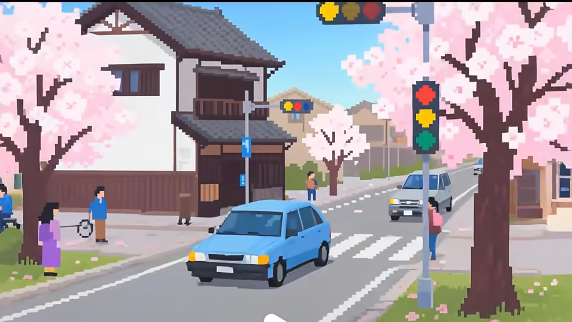

相信你也刷到过不少自己喜欢的像素风视频！随着AI的发展，你也可以生成自己的像素风视频哦~Follow me!

# 正文

## 名词解释：

像素（Pixel，全称为 Picture Element）：构成数字图像或视频的最小单位，本质上是一个带有颜色值的微小方块。手机屏幕、电脑显示器、电视等设备的分辨率以像素为单位，如 "1920×1080"（全高清）、"3840×2160"（4K）。那为什么眼睛感受不出来呢？因为像素密度（PPI，Pixels Per Inch）决定显示细腻度，正是因为屏幕像素密度高，人眼难以分辨单个像素，你才会感受到流畅的物体构成而没有颗粒感。

像素艺术正是通过有限像素构建独特的视觉风格。

## 先有创作思路：

比如选取一个对比式的主题，有前后对比效果的视频更能引起共鸣，我让豆包生成了几个：

1. 昔日租房时妻子在小厨房为我煮面，今日买了带中岛的大厨房，看她笑着烘焙。
2. 过去父亲骑旧自行车送我上学，如今开着新车带他环游全国。
3. 曾经创业失败在出租屋吃泡面，现在公司上市后和合伙人在办公室举杯。
4. 学生时代同桌把橡皮分我一半，如今创业成功后邀她做公司设计总监。
5. 以前母亲用缝纫机给我改旧衣服，现在带她逛商场随便挑名牌时装。

仅供参考~~~

## AI软件与使用：

即梦：字节跳动旗下一站式 AI 创作平台，图像生成能精准理解文字描述，产出多种风格高清图，还具备智能画布等便捷编辑功能；视频生成方面，支持文生视频、图生视频，有动作模仿、对口型等特色，镜头运镜自然。

https://jimeng.jianying.com/ai-tool/home/?utm_medium=bingpc&utm_source=bing&utm_campaign=ppc&msclkid=279a4ec8b63f1d49a1ee269edd93683f

### 1. 生图

（话说这个是真好看

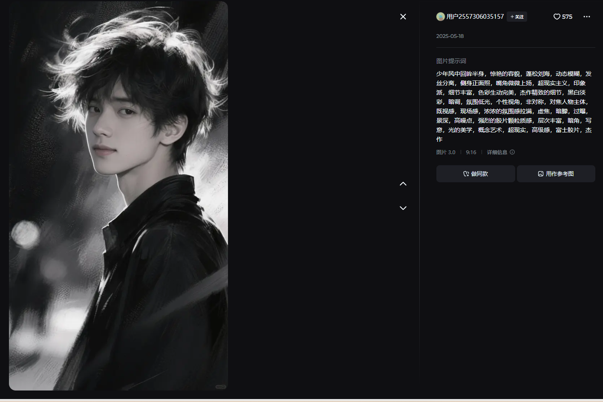

少年风中回眸半身，惊艳的容貌，蓬松刘海，动态模糊，发丝分离，侧身正面照，嘴角微微上扬，超现实主义，印象派，细节丰富，色彩生动完美，杰作精致的细节，黑白淡彩，暗调，氛围低光，个性视角，非对称，对焦人物主体既视感，现场感，浓浓的氛围感拉满，虚售，暗，过景深，高噪点，强烈的胶片颗粒质感，层次丰富，暗角，写意，光的美学，概念艺术，超现实，高级感，富士胶片，杰作）

进入页面后输入提示词：

**主题**：

这里我选取比较和现实靠近的热门的高考主题

**人物**：年轻，学生，蓝白色校服，像素化，动态写题，日式漫画脸

**环境：**考场，浅黄色课桌，像素化陈列，简洁色块表现

**背景：**在写题的其他考生，监考老师，像素化轮廓（雪花飘落）

**气氛**：严肃

**参考的艺术风格（style）**：像素风格插画，像素颗粒感强，线条简洁，色彩明快，模拟复古像素游戏画面，突出场景层次感与怀旧质感，8-bit色彩质感。

**构图** 镜头 焦距 景深(控制画面主体位置）：人物居中，还有其他的细节，比如雪地纹理、课桌纹理

**整体色调：**色调以白黄为主，暖调营造清新氛围。注意多一些贴切的描述，比如石头就是粗糙质感，海滨惬意，山雄伟，火车：空灵、悠远静谧的旅途氛围，给人视觉的开阔心灵的放松。日系风情、自然美感、街道烟火气、城市自然交融，像素复古，都市生活感，黄昏城市韵味

**光线的描述**：阳光从窗外照进

**图片尺寸比例:9:16**

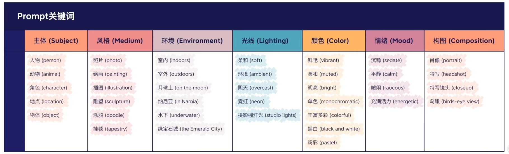

图出自[一站式入门AI绘画！Midjourney胎教级入门指南！普通人也能成为设计师_哔哩哔哩_bilibili](https://www.bilibili.com/video/BV1vm4y1B7gP/?spm_id_from=333.337.search-card.all.click&vd_source=45e7cd9e04ec6a1f93af43dc43effe96)

完整：

**像素风格插画，中国高考考场场景**。**前景:**穿蓝白色校服、日式动漫男主(像素化，动态写题);**中景：**其他考生和书桌（浅黄书桌像素化陈列，简洁色块表现）:**背景:**考场的墙(白色像素块，像素渐变)。**整体色调:**暖白为主，搭配黄、红点缀。特写白色人物，营造日系清新氛围，**像素颗粒感强，线条简洁，色彩明快，模拟复古像素游戏画面，突出场景层次感与怀旧质感，8-bit色彩质感图片（也可以按照画面主体、背景）**

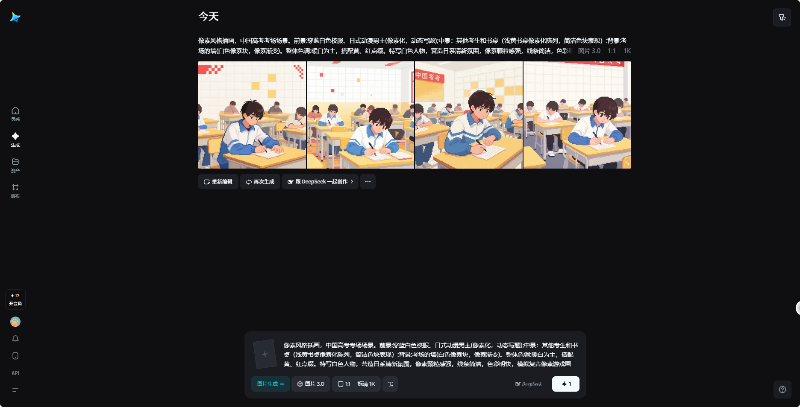

其他优秀prompt（从前面喵比三花小红书链接截图里抠的，眼睛快瞎了):

像素风格插面，日系樱花街道场景。画面中，粉白色花树(像素化花，深褐树枝)分列街道两侧，红色出租车(像素化车身，白顶，亮黄色车灯)行驶在灰色路面上，背景是传统日式建筑(深棕与白色像素块，简化屋顶纹理)。街道旁行人(像索化，身着蓝、紫色块服饰)或驻足或骑行，交通信号灯(黄、红、蓝像素)点缀其间，天空浅蓝(像素渐变)。整体色调以粉白、灰、红、棕为主，搭配清新蓝绿(菜地、树叶)，营造春日浪漫氛围，像素颗粒感强，线条简化。通过色块拼接还原场景层次，模拟复古像素游戏画面，突出樱花的柔美与街道的烟火气，**展现日系街头的细腻质感与空间纵深感**。适配即梦，以像素化元素(如花像素点、车辆色块、建筑轮廓)构建场景，营适怀旧清新视觉，**细节处(如行人动态、樱花分布的结构线条)增强画面生动性。**尽显日系樱花季的独特韵味复古风情。

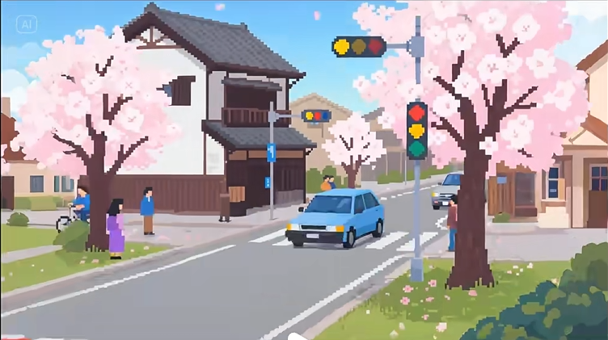

像素风格插画，东京。冷蓝主调，大桥(白像素，灯光)、高楼、东京塔(红色发光)、河面(蓝白波纹)、下方建筑(暖黄灯光)。渐变蓝天(高饱和像素色块)，颗粒感强。色块拼接，模拟复古像素，突出地标与灯光璀璨，展都市活力层次。用像素元素（桥、塔、楼、河、灯)构建，细节增真实，显复古像素都市存夜景美。营造繁华科技感。

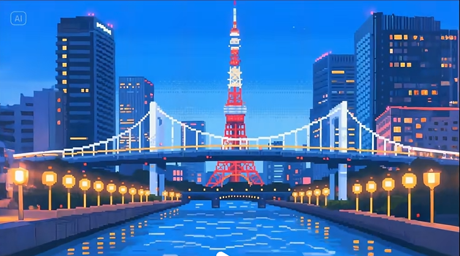

像素字体:"喵笔三花"像素点阵风字体，8BIT游戏风格网格结构清晰，复古数码质
感，色彩复古明亮，适合游戏或潮玩类品牌，黑底彩块字。

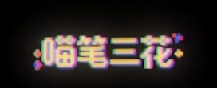

### **2：将静态图片转为视频**

这里补充一些电影级运镜模板的核心解析，结合经典案例与创作逻辑，帮助理解镜头运动的情感传递与视觉语言（豆包）：

### **一、推镜头（Push In）**

**定义**：镜头向主体推进，景别从远到近（如全景→特写），主体在画面中逐渐放大。

**作用**：

- 聚焦关键细节（如角色表情、道具特写），强化情绪冲击；
- 引导观众视线，暗示主体重要性（如《教父》中推镜头聚焦桌面上的马头，制造悬念）。**AI应用**：在即梦等工具中，可用于生成"人物情绪递进"片段（如从全景推至流泪的眼睛）。

### **二、拉镜头（Pull Out）**

**定义**：镜头远离主体，景别从近到远（如特写→全景），展现主体与环境的关系。

**作用**：

- 揭示场景全貌，制造"恍然大悟"的叙事反转（如《大白鲨》开场，从血手特写拉至广阔海面，暗示危险范围）；
- 表达孤独感或渺小感（如角色独站沙漠，拉镜头后凸显环境空旷）。**AI应用**：生成"产品展示视频"时，可用拉镜头从产品特写过渡到使用场景全景。

### **三、摇镜头（Pan）**

**定义**：镜头固定机位，左右/上下摆动，横向或纵向扫描画面。

**作用**：

- 介绍环境规模（如《辛德勒的名单》中摇镜头扫过集中营全景，强化历史厚重感）；
- 跟随运动主体（如摇镜头跟拍奔跑的角色，保持主体在画面中心）。**AI应用**：在"故事生成"中，用摇镜头模拟"观察者视角"（如摇过墓碑群，暗示时间流逝）。

### **四、移镜头（Tracking Shot）**

**定义**：镜头沿水平/垂直方向移动，画面呈现动态平移效果。

**作用**：

- 营造沉浸式跟随体验（如《好家伙》中长达3分钟的跟拍镜头，跟随角色穿过餐厅，展现黑帮生活的流畅感）；
- 串联多个场景（如移镜头从街头橱窗过渡到室内餐桌，实现空间转换）。**AI应用**：生成"vlog风格视频"时，用移镜头模拟手持跟拍，增强真实感。

### **五、环绕镜头（Orbit Shot）**

**定义**：镜头以主体为中心环绕旋转，形成360度视角变化。

**作用**：

- 突出主体存在感（如《复仇者联盟》中钢铁侠登场时的环绕镜头，强化英雄气场）；
- 展示主体多面性（如环绕拍摄花瓶，同时呈现花纹与阴影，丰富视觉层次）。**AI应用**：在"产品广告"中，用环绕镜头生成360度展示视频，搭配光影变化凸显质感。

### **运镜逻辑总结表**

| 运镜类型 | 核心情绪 | 经典场景举例 | AI生成适配场景 |
| --- | --- | --- | --- |
| 推镜头 | 紧张/聚焦 | 《惊魂记》浴室杀人特写 | 人物内心戏、道具细节强调 |
| 拉镜头 | 释然/悬念 | 《楚门的世界》结尾拉至摄影棚 | 场景反转、环境与人物关系展示 |
| 摇镜头 | 宏大/悲悯 | 《现代启示录》摇过燃烧的丛林 | 自然风光、群像场景生成 |
| 移镜头 | 流动/叙事 | 《布达佩斯大饭店》走廊长镜头 | 剧情衔接、跟拍运动场景 |
| 环绕镜头 | 震撼/立体 | 《盗梦空间》旋转走廊环绕拍摄 | 角色登场、产品3D展示 |

**创作提示**：运镜本质是"镜头的呼吸"，需与叙事节奏匹配（如悬疑片多用快推/急摇，文艺片偏爱慢移/环绕）。

还是使用即梦，点击视频生成功能，上传第一步生成的满意图片，选择最新的3.0视频模型，

先学习了下小红书喵比三花博主的生成视频提示词（从截图里抠出来的比较费眼睛）：

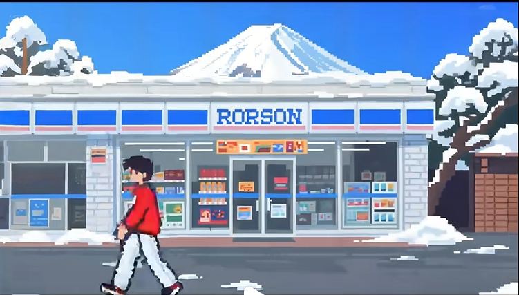

采用像素风格插画，简洁明快。便利店、树木等元素，通过鲜明色彩和规整像素呈现，**人物动作以简单像素帧表现，**营造出复古又清新的冬日生活氛围。运镜提示词 ：**全景展示:固定镜头呈现全景，**展现便利店、富士山及雪景全貌。**人物聚焦:镜头跟随行人移动。特写**其衣着、动作的像素细节。店铺特写:推近镜头，聚集便利店橱窗商品与招牌的像素纹理。环境观察:环绕便利店旋转运镜。展示周边雪景与建筑细节。

运镜提示:全景开场展街景，**缓推**聚焦樱花与车辆，**平移**扫行人、房屋，节奏轻柔舒缓
凸显像素复古与春日宁静场景层次。

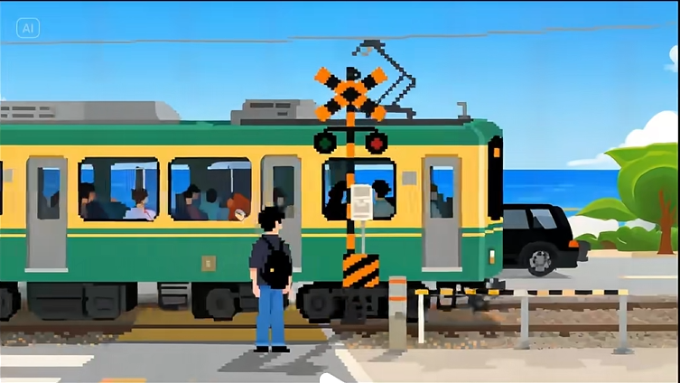

画面风格:清新像素风格插画，以明快色彩、规整像素块构建场景。黄绿相间的电车、黑橙警示装置、深蓝大海与蓝天，均由像素屋现，人物、车辆细节以简洁像素勾勒，营造出复古又充满活力的海滨日常氛围。运镜提示词:开场固定镜头展示全景。捕捉电车、人物、车辆位置关系;镜头平移至电车车窗，聚焦车内乘客:环绕人物旋转，展现其背包、衣着细节:快速推近至交通警示装置，凸显像素纹理:最后拉远，回归全景并渐暗收束。

我自己的实践提示词：

我这个是室内所以不会写直接点生成视频了。。

视频时常选择10s,最后点击生成视频即可。

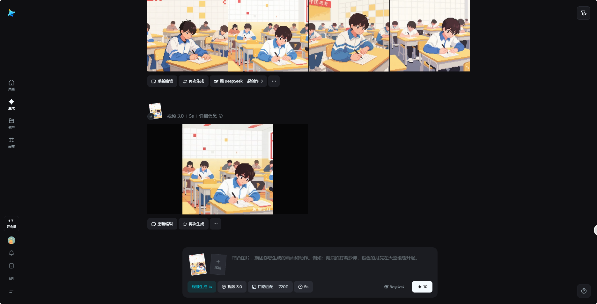

### 3. 配音

**在剪映中完善你的视频**

1、导入视频：将从"即梦"生成的视频下载后导入剪映。

2、 添加背景音乐：选择能够增强情感表达的背景音乐，音乐风格应与视频主题相匹配。

- 治愈系视频可选择轻柔的钢琴曲

- 怀旧风格可选择带有复古感的电子音乐

- 情感类可选择抒情的器乐曲

3、 加入下雨声音效

4、 点击右上角发布

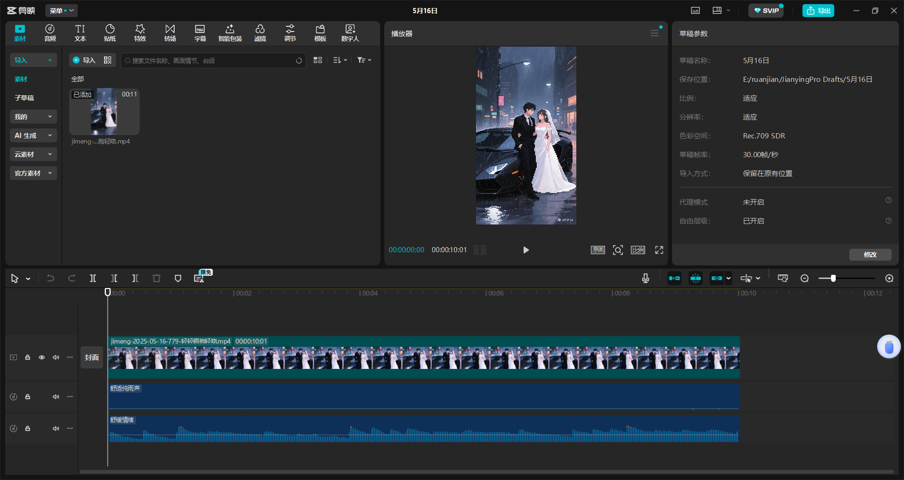

**END**

# 后话：

还有把两个视频上下拼成一个作对比视频的。

现在比较流行的就是失恋主题的对比视频，还有反映老百姓生活艰辛主题的视频，还有些理想的、梦想的现实中不是特别容易实现的主题的视频。感觉像素画在传递细腻情感引发共鸣这块效果还不错挺有感染力的。

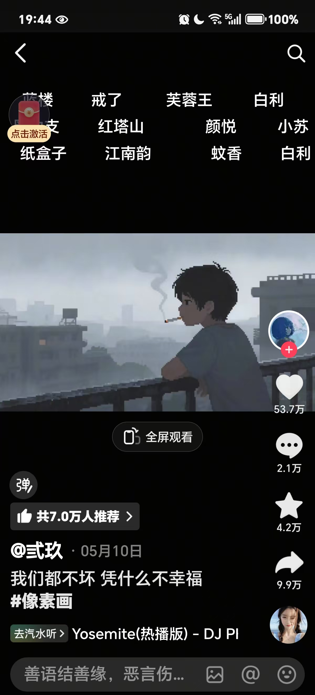

还有这个参考文章可以看下：[https://mp.weixin.qq.com/s/OfFgWV0QBTVOdvCG6HgoGw](https://mp.weixin.qq.com/s/OfFgWV0QBTVOdvCG6HgoGw)